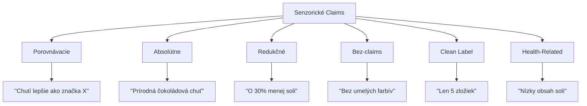
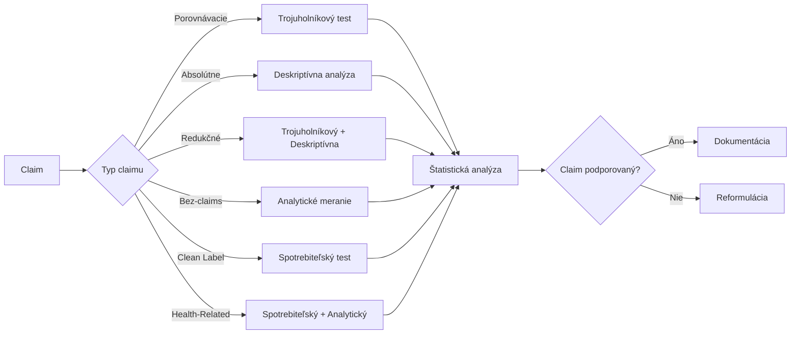
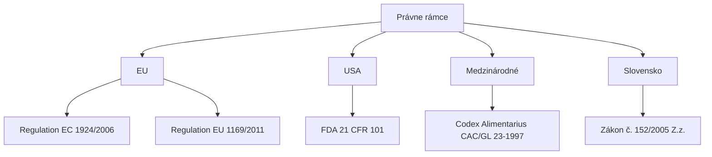

## Úvod

### Čo sú senzorické claims?

Senzorické claims sú **tvrdenia na obale alebo v reklame** potravinárskych produktov, ktoré sa vzťahujú na senzorické vlastnosti produktu:

- Chuť
- Vôňa
- Textúra
- Vzhľad
- Zvuk

::: notes
Každý claim musí byť overiteľný a dokázateľný vedeckými dátami. Nemožno tvrdiť niečo, čo nie je podložené senzorickým testom.
:::

---

## Prečo sú claims dôležité?

| Aspekt | Význam |
|--------|--------|
| **Rozhodovanie spotrebiteľa** | 70–80% nákupných rozhodnutí sa opiera o claims na obale |
| **Diferenciácia** | Výhoda pred konkurenciou na poliach |
| **Cena** | Produkty s overiteľnými claims môžu mať vyššiu cenu |
| **Dôvera** | Overené claims budujú dôveru značky |
| **Právna ochrana** | Nesprávne claims vedú k súdnym sporom a pokutám |

---

## Agenda

1. Typy senzorických claims
2. Metódy na overenie claims
3. Štatistické požiadavky
4. Právne požiadavky (EU/FDA)
5. Praktické príklady
6. Dokumentácia a reporting

---

## Typy claims

---

## Porovnávacie claims

Tvrdenia, ktoré **porovnávajú produkt s iným produktom** (konkurenciou alebo predchádzajúcou verziou).

| Parameter | Požiadavka |
|-----------|------------|
| **Referenčný produkt** | Musí byť jasne identifikovaný |
| **Rozdiel** | Štatisticky významný (p < 0.05) |
| **Veľkosť rozdielu** | Doložiteľná minimálna hodnota |
| **Testovaný parameter** | Špecifikovaný senzorický atribút |
| **Panelista** | Minimálne 60–80 pre porovnávacie testy |

---

## Absolútne claims

Tvrdenia o vlastnostiach produktu **bez priameho porovnania** s iným produktom.

| Parameter | Požiadavka |
|-----------|------------|
| **Deskriptívna analýza** | Kvalifikovaný panel (min. 8–10 trénovaných) |
| **Intenzita** | Špecifikovaná na škále (napr. ≥ 7 na 10-bodovej) |
| **Konzistencia** | ≥ 80% panelistov hodnotí atribút v požadovanom rozsahu |
| **Opakovateľnosť** | Výsledok musí byť reprodukovateľný |

---

## Redukčné claims

Tvrdenia o **znížení obsahu alebo intenzity** niektorej zložky alebo vlastnosti.

| Parameter | Požiadavka |
|-----------|------------|
| **Percentuálny rozdiel** | Overený analytickým meraním a/alebo senzorickým testom |
| **Referenčná hodnota** | Pôvodná hodnota musí byť známa |
| **Minimálny rozdiel** | ≥ 25% pre senzoricky detekovateľný rozdiel |
| **Spotrebiteľský test** | Musí byť preukázaný rozdiel (p < 0.05) |

---

## Bez-claims (Free-From)

| Typ claimu | Právna definícia | Senzorické overenie |
|------------|------------------|---------------------|
| **Bez pridaného cukru** | Žiadny monosacharid/disacharid pridaný | Analytické meranie cukru |
| **Bez umelých farbív** | Žiadne syntetické farbivá | Analytické meranie farbív |
| **Bez konzervantov** | Žiadne zákonom definované konzervanty | Analytické meranie konzervantov |
| **Bez lepku** | < 20 ppm lepku | ELISA test |
| **Bez laktózy** | < 0.1 g laktózy na 100 g | Analytické meranie laktózy |

---

## Metódy overenia

---

## Trojuholníkový test

**Účel:** Overenie, či existuje senzoricky detekovateľný rozdiel medzi dvoma produktami.

**Princíp:** Panelista dostane 3 vzorky – 2 rovnaké a 1 odlišnú.

### Kritické hodnoty (α = 0.05)

| n (panelistov) | Kritický počet správnych odpovedí |
|----------------|----------------------------------|
| 24 | 12 |
| 36 | 17 |
| 48 | 22 |
| 60 | 27 |

---

## Deskriptívna analýza

**Účel:** Kvantifikácia intenzity jednotlivých senzorických atribútov.

| Parameter | Požiadavka |
|-----------|------------|
| **Počet panelistov** | 8–15 trénovaných panelistov |
| **Tréning** | Minimálne 10 hodín trénu na atribút |
| **Opakovania** | Minimálne 3 opakovania na panelistu |
| **Škála** | Lineárna, 0–10 alebo 0–15 bodov |
| **Analýza** | ANOVA s panelistom a opakovaním ako faktormi |

---

## Štatistické požiadavky

### Úroveň významnosti (α)

| Úroveň α | Použitie | Kritická hodnota |
|----------|---------|------------------|
| **0.05** | Štandardná úroveň pre väčšinu testov | 1.96 |
| **0.01** | Prísnejšia kontrola (komerčné claims) | 2.58 |
| **0.10** | Exploratívna analýza | 1.645 |

### Sila testu (Power)

| Power | Význam | Použitie |
|-------|--------|---------|
| **0.80** | Štandardná sila | Väčšina senzorických testov |
| **0.90** | Vysoká sila | Komerčné claims s vysokým rizikom |
| **0.95** | Veľmi vysoká sila | Regulačné účely |

---

## Počet panelistov

| Typ claimu | Typ testu | Min. počet | Odporúčaný počet |
|------------|-----------|------------|------------------|
| **Porovnávacie** | Trojuholníkový test | 36 | 54–60 |
| **Porovnávacie** | Duo-trio test | 32 | 48–64 |
| **Absolútne** | Deskriptívna analýza | 8–10 | 12–15 |
| **Redukčné** | Trojuholníkový + deskriptívna | 36 + 10 | 54 + 12 |
| **Bez-claims** | Analytické meranie | N/A | N/A |
| **Clean label** | Spotrebiteľský test | 100 | 150 |
| **Health-related** | Spotrebiteľský + analytický | 100 | 150 |

---

## Právne požiadavky

---

## EU nariadenia

**Regulation (EC) No 1924/2006:**

| Článok | Obsah | Aplikácia |
|--------|-------|-----------|
| **Čl. 5** | Všeobecné požiadavky | Tvrdenia musia byť pravdivé a overiteľné |
| **Čl. 6** | Vedecké dokazy | Podložené vedeckými dátami |
| **Čl. 7** | Registrácia tvrdení | Výživové a zdravotné tvrdenia registrované |
| **Čl. 10** | Zákaz zavádzajúcich | Nesmú byť zavádzajúce |
| **Čl. 13** | Zdravotné tvrdenia | Vedecké dokazy + schválenie EFSA |

---

## FDA požiadavky

**21 CFR 101 – Food Labeling:**

| Sekcia | Obsah | Aplikácia |
|--------|-------|-----------|
| **101.13** | Tvrdenia o obsahu živín | Analytické merania |
| **101.14** | Zdravotné tvrdenia | Vedecké dokazy |
| **101.54** | Tvrdenia o obsahu tuku | Špecifické požiadavky |
| **101.56** | Tvrdenia o obsahu sodíka | Špecifické požiadavky |
| **101.60** | Tvrdenia o obsahu vlákniny | Špecifické požiadavky |

---

## Praktický príklad

### Claim: "Intenzívna jahodová chuť"

**Krok 1: Definujte merateľný parameter**
- Atribút: Intenzita jahodovej chuti
- Škála: 0–10 bodov
- Kritérium: Priemer ≥ 7.0 a ≥ 80% panelistov ≥ 7

**Krok 2: Vykonajte deskriptívnu analýzu**
- Panel: 12 trénovaných panelistov
- Výsledok: Priemer = 7.8, SD = 1.1
- 95% CI: [7.12, 8.48]
- % panelistov ≥ 7: 83%

**Krok 3: Vyhodnoťte**
- ✓ Dolná hranica CI (7.12) ≥ 7.0
- ✓ 83% panelistov ≥ 7.0
- ✓ **Claim je PODPORENÝ**

---

## Časté chyby

| Chyba | Príklad | Ako sa vyhnúť |
|-------|---------|---------------|
| **Nedostatočný počet panelistov** | n = 10 pre trojuholníkový test | Minimálne 36–54 panelistov |
| **Nesprávna štatistická analýza** | t-test namiesto binomického | Konzultácia so štatistikom |
| **Zavádzajúci claim** | "Prírodní chuť" bez dôkazu | Overenie analytickým meraním |
| **Nedostatočná dokumentácia** | Chýbajúce záznamy | Kompletný protokol |
| **Ignorovanie variability** | Priemer bez CI | Vždy uvádzajte 95% CI |

---

## Dokumentácia

### Štruktúra dokumentácie

1. **Účel testu** — claim, hypotéza, kritériá úspechu
2. **Dizajn testu** — typ testu, počet panelistov, opakovania
3. **Vzorky** — popis produktu, podmienky skladovania
4. **Panelisti** — počet, demografia, tréning
5. **Výsledky** — surové dáta, štatistická analýza
6. **Záver** — zhodnotenie hypotézy, podpora claimu
7. **Prílohy** — surové dáta, štatistické výstupy

---

## Záver

Senzorické claims sú mocným nástrojom marketingovej komunikácie, ale vyžadujú si **prísnosť k vedeckým dátam a právnym predpisom**.

Každý claim musí byť:

- ✓ **Overiteľný** — podložený senzorickým testom
- ✓ **Právne slušný** — v súlade s EU/FDA/Codex predpismi
- ✓ **Zrozumiteľný** — jasný pre spotrebiteľa
- ✓ **Dokumentovaný** — s kompletnou dokumentáciou

---

## Ďakujem za pozornosť

**Otázky?**

*SAP — Senzorická Analýza Potravín*
