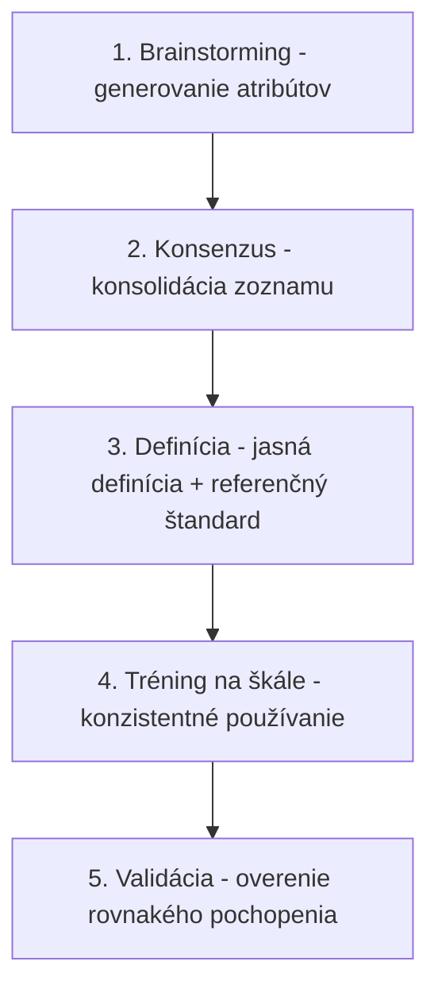
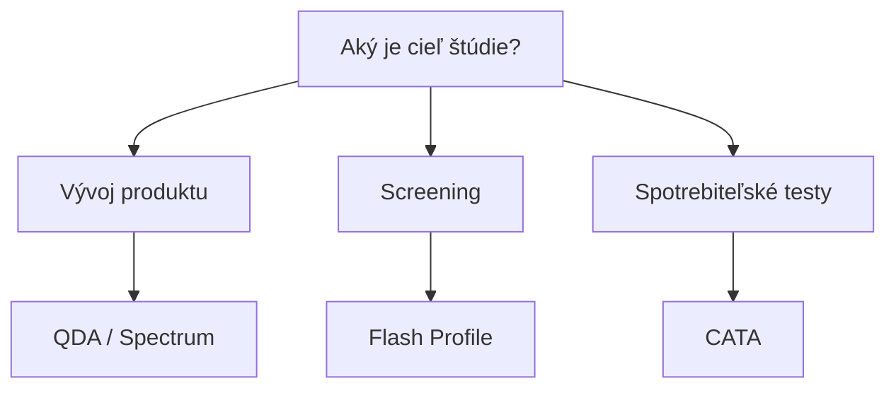

## Úvod

::: {style="text-align: center;"}
### Čo sú deskriptívne profily?

Systematické, kvantitatívne popisy senzorických vlastností produktov. Poskytujú objektívny opis toho, čo senzorický panelista vníma – vrátane **intenzity** jednotlivých atribútov chuti, vônej, textúry a vizuálnych charakterík.
:::

## Na čo sa používajú?

- **Vývoj produktov** – porovnanie prototypov s referenciami
- **Kontrola kvality** – monitorovanie konzistentnosti v čase
- **Stabilita produktu** – sledovanie senzorických zmien počas skladovania
- **Korekcia receptúr** – identifikácia senzorických deficitov
- **Kategorizácia produktov** – mapovanie produktového priestoru
- **Korelačná analýza** – prepojenie senzorických dát s preferenciami spotrebiteľov

## História

| Obdobie | Vývoj |
|---------|-------|
| 1940s | Prvé systematické pokusy o deskriptívnu analýzu v USDA |
| 1950s | Vývoj Flavor Profile Method (Arthur D. Little) |
| 1970s | Vznik Quantitative Descriptive Analysis (QDA) – Stone et al. |
| 1980s | Texture Profile Method (Brandt et al.) |
| 1990s | Spectrum Method – standardizované slovníky |
| 2000s | Free Choice Profiling, Flash Profile |
| 2010s | CATA, TDS, TCATA – dynamické metódy |

## Quantitative Descriptive Analysis (QDA)

### Princíp

QDA bola vyvinutá **Haroldom Stoneom** na začiatku 70. rokov. Skúsení panelisti dokážu nezávisle identifikovať a kvantifikovať absolútné intenzity senzorických atribútov.

### Počet panelistov a tréning

- **Počet panelistov:** 8–12 trénovaných panelistov
- **Tréning:** 60–90 hodín v priebehu 3–6 mesiacov
- **Selekcia:** nadpriemerná senzorická citlivosť a schopnosť verbálne popísať vjemy
- **Certifikácia:** pravidelné testy citlivosti a reprodukovateľnosti

## QDA – Generovanie deskriptorov



### Škálovanie

QDA používa **lineárnu škálu** (typicky 15-bodovú alebo 100 mm VAS):

```
0 = neprítomné                    15 = extrémne intenzívne
|---------|---------|---------|---------|
0         5        10        15
```

## QDA – Analýza dát

### ANOVA (Analýza rozptylu)

| Zdroj variability | SS | df | MS | F | p |
|---|---|---|---|---|---|
| Produkt | SS_P | p-1 | MS_P | F_P | p_P |
| Panelista | SS_S | s-1 | MS_S | F_S | p_S |
| Produkt × Panelista | SS_PS | (p-1)(s-1) | MS_PS | F_PS | p_PS |
| Chyba | SS_E | ... | MS_E | — | — |
| Celkovo | SS_T | n-1 | — | — | — |

### PCA (Analýza hlavných zložiek)

- Redukcia dimenzionality
- Identifikácia hlavných zdrojov variability
- Vizualizácia vzťahov medzi produktmi a atribútmi
- Detekcia outlierov

## Spectrum Method

### Princíp

Metóda vyvinutá **Gail Vance Civille**, ktorá používa **štandardizované slovníky** pre každú senzorickú dimenziu.

### Štandardizované slovníky

| Senzorická dimenzia | Príklad atribútov | Referenčné štandardy |
|---------------------|-------------------|----------------------|
| Vôňa | kvetinová, ovocná, orechová, korenenová | Etapy, vanilín, citrónová kyselina |
| Chuť | sladká, kyslá, slaná, horká, umami | Sacharóz, kyselina citrónová, NaCl, kofeín, MSG |
| Textúra | krémová, tuhá, vláčna, chrumkavá | Nátierky, želatín, karamel |
| Vizuálna | farba, lesk, homogenita | Farebné štandardy, fotky |

## Flavor Profile Method

### Princíp

Metóda vyvinutá v roku **1949** v spoločnosti **Arthur D. Little**. Popisuje komplexnú vôňu a chuť produktu pomocou špeciálneho jazyka.

### 4-bodová škála

| Úroveň | Označenie | Popis |
|--------|-----------|-------|
| 1 | T (threshold) | Len znateľná intenzita |
| 2 | S (slight) | Slabá intenzita |
| 3 | M (moderate) | Stredná intenzita |
| 4 | L (large) | Vysoká intenzita |

## Texture Profile Method

### Princíp

Metóda vyvinutá **Alinou Brandtovou** – kvantifikuje mechanické, geometrické a chemické vlastnosti textúry prostredníctvom **dvojitého hodnotenia** (simulovanie dvoch žuvacích pohybov).

### Atribúty textúry

| Kategória | Atribúty | Popis |
|-----------|----------|-------|
| Mechanická | Tvrdosť, žuvacívosť, lepkavosť, pružnosť | Silové vlastnosti |
| Geometrická | Hrubosť, zrnitosť, vláčnosť | Fyzická štruktúra |
| Chemická | Tukovitosť, vlhkosť | Vlastnosti surovín |

## Free Choice Profiling

### Princíp

Panelisti používajú **vlastné deskriptory** namiesto predpísaného zoznamu. Každý panelista vypracuje slovník podľa vlastného vnímania.

### GPA analýza

**Generalized Procrustes Analysis:**

- Zarovnanie individuálnych konfigurácií do spoločného priestoru
- Vytvorenie konsenzuálneho senzorického profilu
- Vizualizácia rozdielov medzi panelistami

## Flash Profile

### Princíp

**Rýchla deskriptívna metóda** – kombinuje princípy FCP s priamym porovnaním produktov. Panelisti hodnotia všetky produkty naraz a generujú vlastné deskriptory.

### Kedy použiť

- Screening veľkého počtu produktov
- Exploratórna fáza výskumu
- Keď je potrebná rýchla odpoveď
- Pri obmedzených zdrojoch

## Check-All-That-Apply (CATA)

### Princíp

**Kvalitatívna metóda** – spotrebiteľi (nie trénovaní panelisti) označia všetky deskriptory, ktoré podľa nich charakterizujú produkt. Výsledkom je **binárna matica (0/1)**.

### Výpočet frekvencií

$$\text{Frekvencia (\%)} = \frac{\text{Počet označení}}{\text{Počet respondentov}} \times 100$$

### Chi-square test

$$\chi^2 = \sum \frac{(O - E)^2}{E}$$

Kde O = pozorovaná frekvencia, E = očakávaná frekvencia.

## Temporal Dominance of Sensations (TDS)

### Princíp

**Dynamická metóda** – sleduje dominantné senzorické vjemy v čase počas spotreby produktu.


### TDS krivky

- **Os X:** Čas (s)
- **Os Y:** Pravdepodobnosť, že je atribút dominantný
- **Každá krivka:** Jeden atribút

### Signifikantnosť

$$P(X \geq k) = \sum_{i=k}^{n} \binom{n}{i} \cdot p_0^i \cdot (1-p_0)^{n-i}$$

Kde $p_0 = 1/n$ (náhodná dominancia).

## Temporal Check-All-That-Apply (TCATA)

### Princíp

**Dynamická verzia CATA** – spotrebiteľi v priebehu spotreby označujú všetky atribúty, ktoré v danom okamihu vnímajú (nie len dominantné).

### Výhody a nevýhody

| Výhody | Nevýhody |
|--------|----------|
| Komplexný dynamický profil | Veľa dát na analýzu |
| Vhodné pre produkty s komplexnou senzorikou | Vyžaduje špecializovaný softvér |
| Menej náročné na panelistov než TDS | |

## Porovnanie metód

| Metóda | Typ | Tréning | Čas | Citlivosť | Reprodukovateľnosť | Vhodné pre |
|--------|-----|---------|-----|-----------|---------------------|------------|
| QDA | Kvantitatívna | Vysoký | Vysoký | Vysoká | Vysoká | Vývoj, kontrola kvality |
| Spectrum | Kvantitatívna | Vysoký | Stredný | Vysoká | Vysoká | Priemysel, certifikácia |
| Flavor Profile | Kvalitatívno-kvantitatívna | Stredný | Nízky | Nízka | Stredná | Rýchly screening |
| Texture Profile | Kvantitatívna | Vysoký | Vysoký | Vysoká | Vysoká | Textúra produktov |
| Free Choice | Kvantitatívna | Nízky | Stredný | Stredná | Nízka | Nové kategórie |
| Flash Profile | Kvantitatívna | Nízky | Nízky | Stredná | Nízka | Screening |
| CATA | Kvalitatívna | Žiadny | Nízky | Stredná | Stredná | Spotrebiteľské testy |
| TDS | Kvantitatívna | Stredný | Stredný | Vysoká | Vysoká | Dynamické produkty |
| TCATA | Kvalitatívna | Žiadany | Stredný | Stredná | Stredná | Dynamické produkty |

## Výber správnej metody



## Faktory rozhodovania

| Faktor | Odporúčaná metóda |
|--------|-------------------|
| Potreba kvantitatívnych dát | QDA, Spectrum |
| Obmedzený čas | Flash Profile, CATA |
| Nová kategória produktu | Free Choice Profiling |
| Dynamické vjemy | TDS, TCATA |
| Nízke náklady | CATA, Flash Profile |
| Vysoká reprodukateľnosť | QDA, Spectrum |
| Spotrebiteľské preferencie | CATA, Flash Profile |

## Praktický príklad 1: Výnový jogurt

**Cieľ:** Porovnať senzorický profil 3 výrobcov jogurtov.

**Metóda:** QDA s 10 panelistami, 15 deskriptorov.

**Výsledky:**

| Produkt | Krémosť | Kyslosť |
|---------|---------|---------|
| Jogurt A | 12.3 | 7.1 |
| Jogurt B | 5.2 | 11.8 |
| Jogurt C | 8.5 | 8.2 |

**Záver:** Jogurt A je najviac krémny, Jogurt B najkyslejší.

## Praktický príklad 2: Čokoláda

**Cieľ:** Identifikovať kľúčové deskriptory kvality čokolády.

**Metóda:** CATA s 150 spotrebiteľmi, 20 deskriptorov.

**Výsledky:**

| DeskCRIPTOR | Frekvencia |
|-------------|------------|
| Krémosa | 78% |
| Horká chuť | 45% |
| Orechová vôňa | 32% |

**Záver:** Krémosť je najdôležitejší atribút pre spotrebiteľov.

## Praktický príklad 3: Čaj

**Cieľ:** Sledovať dynamiku senzorických vjemov pri spotrebi čaju.

**Metóda:** TDS s 12 panelistami, 8 atribútov.

**Výsledky:**

| Časový interval | Dominantný atribút |
|-----------------|-------------------|
| 0–10 s | Sladkosť |
| 10–25 s | Horkosť |
| 25–40 s | Horkosť + horká chuť |

**Záver:** Počiatočná sladkosť sa mení na horkosť, čo môže byť negatívny signál.

## Záver

Deskriptívne predstavujú **nástroj pre kompletný popis** senzorických vlastností produktu.

Výber správnej metódy závisí od:

- **Cieľa štúdie** (vývoj vs. screening vs. spotrebiteľské testy)
- **Dostupných zdrojov** (čas, tréning, náklady)
- **Typu produktu** (komplexnosť, dynamika spotreby)
- **Požadovanej citlivosti** a reprodukateľnosti

> Kombinácia deskriptívnych profilov s preferenčnými dátami poskytuje **komplexný obraz** o senzorických vlastnostiach a spotrebiteľských preferenciách.

## Referencie

- Lawless, H.T. & Heymann, H. (2010). *Sensory Evaluation of Food: Principles and Practices*. Springer.
- Stone, H. & Sidel, J.L. (2004). *Sensory Evaluation Practices*. Elsevier.
- Civille, G.V. (2011). *Sensory Evaluation Techniques*. CRC Press.
