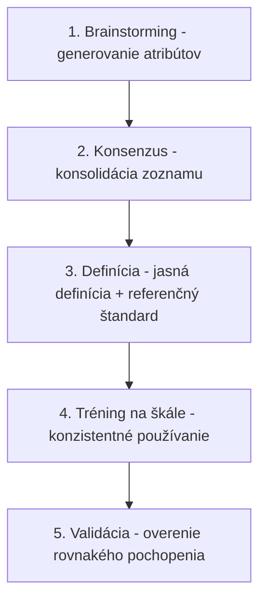
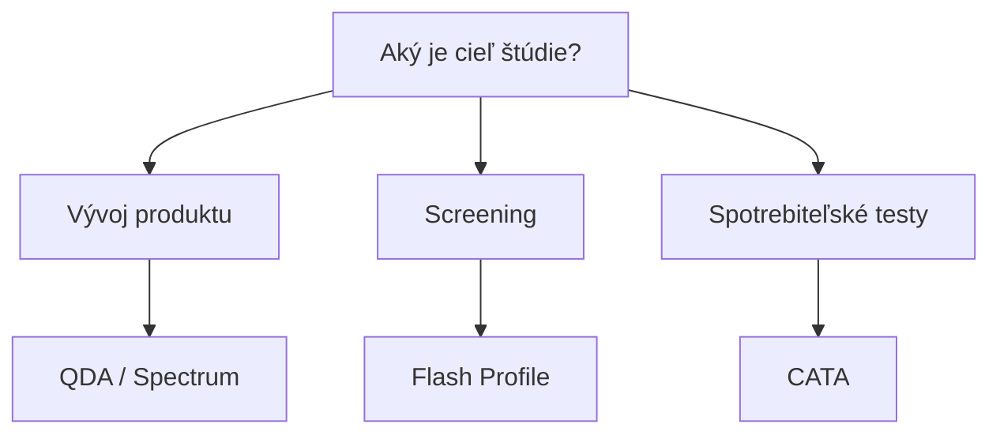

## Úvod

::: {style="text-align: center;"}
### Čo sú deskriptívne profily?

Systematické, kvantitatívne popisy senzorických vlastností produktov. Poskytujú objektívny opis toho, čo senzorický panelista vníma – vrátane **intenzity** jednotlivých atribútov chuti, vônej, textúry a vizuálnych charakterík.
:::

## Na čo sa používajú?

- **Vývoj produktov** – porovnanie prototypov s referenciami
- **Kontrola kvality** – monitorovanie konzistentnosti v čase
- **Stabilita produktu** – sledovanie senzorických zmien počas skladovania
- **Korekcia receptúr** – identifikácia senzorických deficitov
- **Kategorizácia produktov** – mapovanie produktového priestoru
- **Korelačná analýza** – prepojenie senzorických dát s preferenciami spotrebiteľov

## História

| Obdobie | Vývoj |
|---------|-------|
| koniec 1940s | Flavor Profile Method (Arthur D. Little) |
| 1963 | Texture Profile Method (Brandt, Skinner & Coleman) |
| 1974 | Quantitative Descriptive Analysis (Stone et al.) |
| 1980s | Spectrum Method · Free Choice Profiling (1984) |
| 2000s | Flash Profile (2002) · CATA (~2007) · TDS (2009) |
| 2010s | TCATA (2016) |

## Quantitative Descriptive Analysis (QDA)

### Princíp

QDA vyvinuli **Herbert Stone** a kolegovia (1974). Trénovaní panelisti nezávisle kvantifikujú **relatívne rozdiely** v intenzite atribútov; rozdiely v používaní škály rieši ANOVA.

### Počet panelistov a tréning

- **Počet panelistov:** 8–12 trénovaných panelistov
- **Tréning:** rádovo 10–20 hodín (niekoľko týždňov); Spectrum vyžaduje výrazne dlhší tréning
- **Selekcia:** nadpriemerná senzorická citlivosť a schopnosť verbálne popísať vjemy
- **Certifikácia:** pravidelné testy citlivosti a reprodukovateľnosti

## QDA – Generovanie deskriptorov



### Škálovanie

QDA používa **nestrukturovanú lineárnu škálu** (~15 cm, kotvy ~1,25 cm od okrajov):

```
0 = neprítomné                    15 = extrémne intenzívne
|---------|---------|---------|---------|
0         5        10        15
```

## QDA – Analýza dát

### ANOVA (Analýza rozptylu)

| Zdroj variability | SS | df | MS | F | p |
|---|---|---|---|---|---|
| Produkt | SS_P | p-1 | MS_P | F_P | p_P |
| Panelista | SS_S | s-1 | MS_S | F_S | p_S |
| Produkt × Panelista | SS_PS | (p-1)(s-1) | MS_PS | F_PS | p_PS |
| Chyba | SS_E | ... | MS_E | — | — |
| Celkovo | SS_T | n-1 | — | — | — |

*Panelista = náhodný efekt → F_P = MS_P / MS_PS (zmiešaný model; [SaIT cvičenie 16](https://senzorika.github.io/SaIT/teoria/cvicenie16.html)).*

### PCA (Analýza hlavných zložiek)

- Redukcia dimenzionality
- Identifikácia hlavných zdrojov variability
- Vizualizácia vzťahov medzi produktmi a atribútmi
- Detekcia outlierov

## Spectrum Method

### Princíp

Metóda vyvinutá **Gail Vance Civille**, ktorá používa **štandardizované lexikóny** a **univerzálnu škálu 0–15** ukotvenú referenčnými vzorkami.

### Štandardizované slovníky

| Senzorická dimenzia | Príklad atribútov | Referenčné štandardy |
|---------------------|-------------------|----------------------|
| Vôňa | kvetinová, ovocná, orechová, korenistá | Referenčné látky (napr. vanilín, citral) |
| Chuť | sladká, kyslá, slaná, horká, umami | Roztoky sacharózy, kys. citrónovej, NaCl, kofeínu, MSG |
| Textúra | tvrdosť, súdržnosť, lepivosť, chrumkavosť | Referenčné potraviny na škále |
| Vizuálna | farba, lesk, homogenita | Farebné štandardy, fotky |

## Flavor Profile Method

### Princíp

Metóda vyvinutá koncom 40. rokov v spoločnosti **Arthur D. Little**. Malý panel expertov (4–6) dospeje ku **konsenzuálnemu profilu** vône a chuti.

### Škála intenzity

| Symbol | Význam |
|--------|--------|
| 0 | Neprítomné |
| )( | Na prahu (threshold) |
| 1 | Slabá (slight) |
| 2 | Stredná (moderate) |
| 3 | Silná (strong) |

## Texture Profile Method

### Princíp

Metóda z General Foods (**Brandt, Skinner & Coleman, 1963**; ISO 11036:2020) – hodnotí mechanické, geometrické a ďalšie (vlhkosť, tuk) vlastnosti **v poradí, ako sa objavujú**: prvé zahryznutie → žuvanie → reziduum. (Nezamieňať s inštrumentálnou TPA – dvojitou kompresiou.)

### Atribúty textúry

| Kategória | Atribúty | Popis |
|-----------|----------|-------|
| Mechanická | Tvrdosť, súdržnosť, lepivosť, pružnosť, žuvateľnosť | Reakcia na silu |
| Geometrická | Zrnitosť, vláknitosť, kryštalickosť | Veľkosť, tvar a orientácia častíc |
| Ostatné | Vlhkosť, šťavnatosť, mastnosť | Vnímanie vody a tuku |

## Free Choice Profiling

### Princíp

Panelisti používajú **vlastné deskriptory** namiesto predpísaného zoznamu. Každý panelista vypracuje slovník podľa vlastného vnímania.

### GPA analýza

**Generalized Procrustes Analysis:**

- Zarovnanie individuálnych konfigurácií do spoločného priestoru
- Vytvorenie konsenzuálneho senzorického profilu
- Vizualizácia rozdielov medzi panelistami

## Flash Profile

### Princíp

**Rýchla deskriptívna metóda** (Dairou & Sieffermann, 2002) – panelisti dostanú všetky produkty naraz, vytvoria vlastné deskriptory a podľa každého produkty **zoradia**; analýza GPA/MFA.

### Kedy použiť

- Screening veľkého počtu produktov
- Exploratórna fáza výskumu
- Keď je potrebná rýchla odpoveď
- Pri obmedzených zdrojoch

## Check-All-That-Apply (CATA)

### Princíp

Spotrebitelia (nie trénovaní panelisti) označia všetky deskriptory, ktoré podľa nich charakterizujú produkt. Výsledkom je **binárna matica (0/1)** → frekvencie.

### Výpočet frekvencií

$$\text{Frekvencia (\%)} = \frac{\text{Počet označení}}{\text{Počet respondentov}} \times 100$$

### Cochranov Q test

Každý respondent hodnotí všetky produkty → závislé binárne dáta:

$$Q = \frac{(k-1)\left[k\sum_j C_j^2 - N^2\right]}{kN - \sum_i R_i^2} \sim \chi^2(k-1)$$

Párovo McNemarov test; mapa produktov: korešpondenčná analýza ([SaIT 17](https://senzorika.github.io/SaIT/teoria/cvicenie17.html)).

## Temporal Dominance of Sensations (TDS)

### Princíp

**Dynamická metóda** – sleduje dominantné senzorické vjemy v čase počas spotreby produktu.


### TDS krivky

- **Os X:** Čas (s)
- **Os Y:** Pravdepodobnosť, že je atribút dominantný
- **Každá krivka:** Jeden atribút

### Signifikantnosť

$$P_s = P_0 + 1.645\sqrt{\frac{P_0(1-P_0)}{n}}, \quad P_0 = \frac{1}{k}$$

Kde $k$ = počet atribútov, $n$ = počet hodnotení (Pineau et al., 2009).

## Temporal Check-All-That-Apply (TCATA)

### Princíp

**Dynamická verzia CATA** (Castura et al., 2016) – hodnotitelia počas konzumácie označujú a odznačujú všetky atribúty, ktoré v danom okamihu vnímajú (nie len dominantné).

### Výhody a nevýhody

| Výhody | Nevýhody |
|--------|----------|
| Komplexný dynamický profil | Veľa dát na analýzu |
| Vhodné pre produkty s komplexnou senzorikou | Vyžaduje špecializovaný softvér |
| Menej náročné na panelistov než TDS | |

## Porovnanie metód

| Metóda | Typ | Tréning | Čas | Citlivosť | Reprodukovateľnosť | Vhodné pre |
|--------|-----|---------|-----|-----------|---------------------|------------|
| QDA | Kvantitatívna | Vysoký | Vysoký | Vysoká | Vysoká | Vývoj, kontrola kvality |
| Spectrum | Kvantitatívna | Vysoký | Stredný | Vysoká | Vysoká | Priemysel, certifikácia |
| Flavor Profile | Kvalitatívno-kvantitatívna | Stredný | Nízky | Nízka | Stredná | Rýchly screening |
| Texture Profile | Kvantitatívna | Vysoký | Vysoký | Vysoká | Vysoká | Textúra produktov |
| Free Choice | Kvantitatívna | Nízky | Stredný | Stredná | Nízka | Nové kategórie |
| Flash Profile | Poradová | Nízky | Nízky | Stredná | Nízka | Screening |
| CATA | Binárna (frekvencie) | Žiadny | Nízky | Stredná | Stredná | Spotrebiteľské testy |
| TDS | Binárna v čase | Stredný | Stredný | Stredná | Stredná | Dynamické produkty |
| TCATA | Binárna v čase | Nízky–stredný | Stredný | Stredná | Stredná | Dynamické produkty |

## Výber správnej metody



## Faktory rozhodovania

| Faktor | Odporúčaná metóda |
|--------|-------------------|
| Potreba kvantitatívnych dát | QDA, Spectrum |
| Obmedzený čas | Flash Profile, CATA |
| Nová kategória produktu | Free Choice Profiling |
| Dynamické vjemy | TDS, TCATA |
| Nízke náklady | CATA, Flash Profile |
| Vysoká reprodukateľnosť | QDA, Spectrum |
| Spotrebiteľský popis produktov | CATA (+ penalty-lift) |

## Praktický príklad 1: Jogurt

**Cieľ:** Porovnať senzorický profil 3 výrobcov jogurtov.

**Metóda:** QDA s 10 panelistami, 15 deskriptorov.

**Výsledky:**

| Produkt | Krémosť | Kyslosť |
|---------|---------|---------|
| Jogurt A | 12.3 | 7.1 |
| Jogurt B | 5.2 | 11.8 |
| Jogurt C | 8.5 | 8.2 |

**Záver:** Jogurt A je najviac krémový, Jogurt B najkyslejší.

## Praktický príklad 2: Čokoláda

**Cieľ:** Identifikovať kľúčové deskriptory kvality čokolády.

**Metóda:** CATA s 150 spotrebiteľmi, 20 deskriptorov.

**Výsledky:**

| Deskriptor | Frekvencia |
|-------------|------------|
| Krémová | 78% |
| Horká chuť | 45% |
| Orechová vôňa | 32% |

**Záver:** Krémovosť je najčastejšie označovaný deskriptor — o *dôležitosti* pre obľúbenosť to však nehovorí (treba penalty-lift analýzu s hedonickou otázkou).

## Praktický príklad 3: Čaj

**Cieľ:** Sledovať dynamiku senzorických vnemov pri pití čaju.

**Metóda:** TDS s 12 panelistami, 8 atribútov.

**Výsledky:**

| Časový interval | Dominantný atribút |
|-----------------|-------------------|
| 0–10 s | Sladkosť |
| 10–25 s | Horkosť |
| 25–40 s | Trpkosť (adstringencia) |

**Záver:** Počiatočná sladkosť prechádza do horkosti a v dochuti do trpkosti, čo môže byť negatívny signál.

## Záver

Deskriptívne predstavujú **nástroj pre kompletný popis** senzorických vlastností produktu.

Výber správnej metódy závisí od:

- **Cieľa štúdie** (vývoj vs. screening vs. spotrebiteľské testy)
- **Dostupných zdrojov** (čas, tréning, náklady)
- **Typu produktu** (komplexnosť, dynamika spotreby)
- **Požadovanej citlivosti** a reprodukateľnosti

> Kombinácia deskriptívnych profilov s preferenčnými dátami poskytuje **komplexný obraz** o senzorických vlastnostiach a spotrebiteľských preferenciách.

## Referencie

- Lawless, H.T. & Heymann, H. (2010). *Sensory Evaluation of Food: Principles and Practices*. Springer.
- Stone, H. & Sidel, J.L. (2004). *Sensory Evaluation Practices*. Elsevier.
- Civille, G.V. (2011). *Sensory Evaluation Techniques*. CRC Press.

## Precvič v R – SaIT {.smaller}

Praktické cvičenia k tejto téme v repozitári [SaIT – Senzometria v R](https://github.com/senzorika/SaIT):

| Téma | Cvičenie SaIT |
|---|---|
| ANOVA profilov, post-hoc | [5b – Porovnanie viacerých vzoriek](https://senzorika.github.io/SaIT/teoria/cvicenie05b.html) |
| PCA, biplot | [7 – PCA a faktorová analýza](https://senzorika.github.io/SaIT/teoria/cvicenie07.html) |
| Zhluková analýza produktov | [8 – Zhluková analýza](https://senzorika.github.io/SaIT/teoria/cvicenie08.html) |
| Radarový graf (profilogram) | [12 – JAR škála a radarový graf](https://senzorika.github.io/SaIT/teoria/cvicenie12.html) |
| Výkonnosť panelu (ISO 11132) | [15 – Výkonnosť senzorického panelu](https://senzorika.github.io/SaIT/teoria/cvicenie15.html) |
| Zmiešané modely (hodnotiteľ ako náhodný efekt) | [16 – Zmiešané modely](https://senzorika.github.io/SaIT/teoria/cvicenie16.html) |
| CATA, napping | [17 – CATA a napping](https://senzorika.github.io/SaIT/teoria/cvicenie17.html) |
| TDS, TCATA | [18 – Temporálne metódy – TDS a TCATA](https://senzorika.github.io/SaIT/teoria/cvicenie18.html) |

Prednášky: [Senzorický panel ako merací prístroj](https://senzorika.github.io/SaIT/prezentacie/sk/04_panel.html) · [Vzťahy a viacrozmerné metódy](https://senzorika.github.io/SaIT/prezentacie/sk/05_viacrozmerne_metody.html) · [Rýchle a temporálne metódy](https://senzorika.github.io/SaIT/prezentacie/sk/07_rychle_temporalne_metody.html)

::: {.callout-note}
Obsah bol v 09/2026 overený a opravený — pozri [Overenie zdrojov](../overenie/overenie_zdrojov.md).
:::
