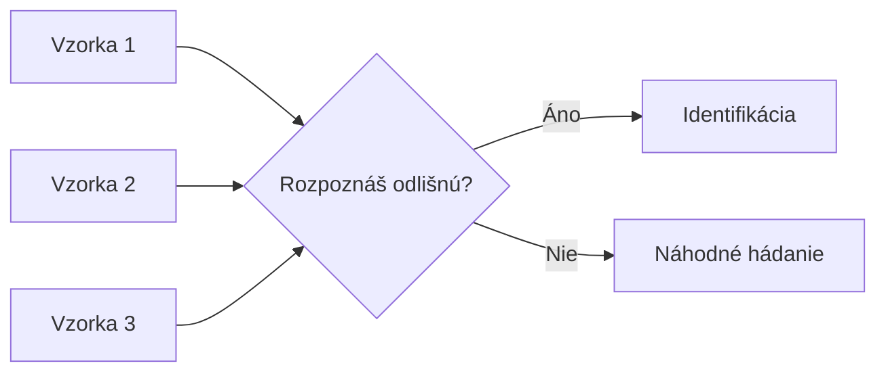
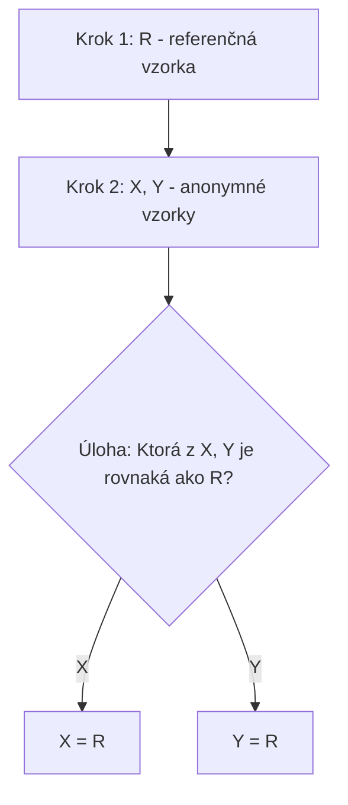
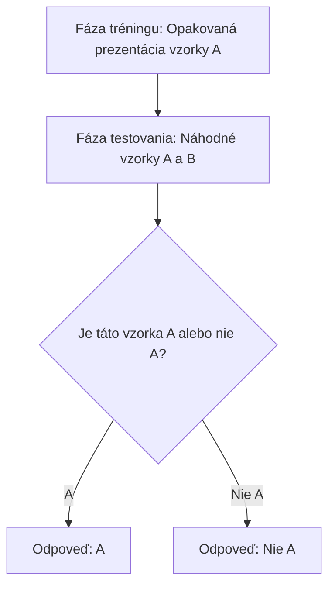
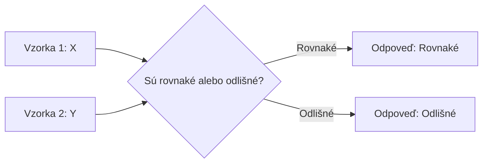
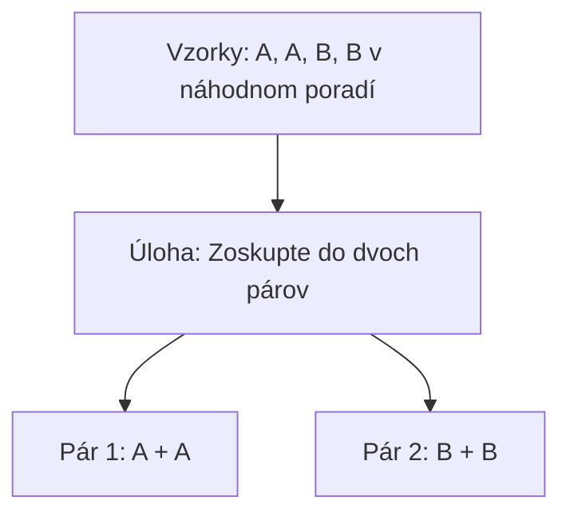
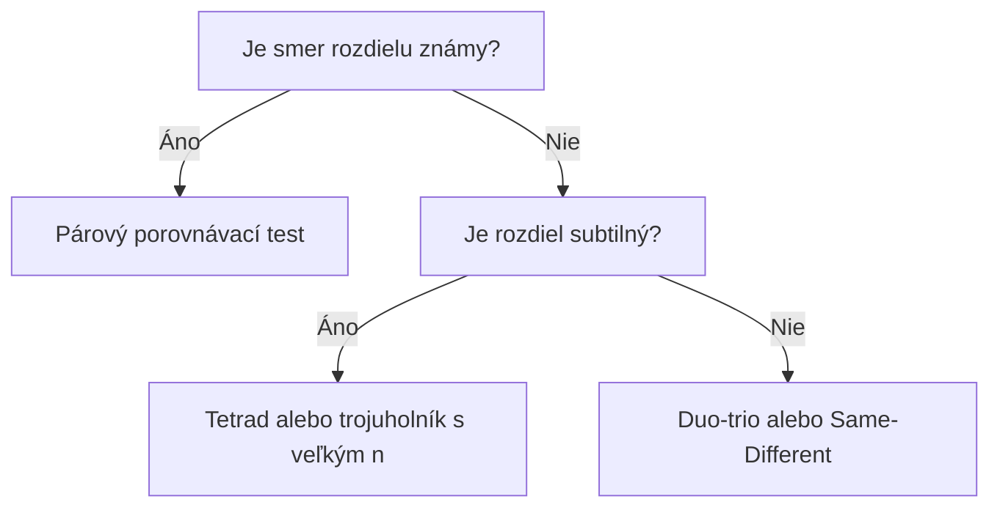

## Úvod

::: {style="text-align: center;"}
### Čo sú diskriminačné metody?

**Testy rozlíšenia** (difference tests) — skupina senzorických techník, ktorých cieľom je zistiť, či existuje **významný senzorický rozdiel** medzi dvoma alebo viacerými vzorkami.

> *„Rozpozná testovateľ rozdiel medzi vzorkami?"*
:::

## Na čo sa používajú?

| Oblast aplikácie | Príklad použitia |
|---|---|
| **Kontrola kvality** | Zmena suroviny, nový dodávateľ |
| **Vývoj produktu** | Optimalizácia receptúry, zníženie cukru/tuku |
| **Stabilita produktu** | Overenie trvanlivosti, porovnanie s referenciou |
| **Výrobný proces** | Zmena parametrov výroby (teplota, čas) |
| **Konzumentské testy** | Porovnanie s konkurenciou, testovanie „me-too" produktu |
| **Výber panelistov** | Skríning tréning senzorového panelu |

## Typy diskriminačných metód

```mermaid
graph TD
    A[Diskriminačné metody] --> B[Trojuholníkový test]
    A --> C[Duo-trio test]
    A --> D[Párový porovnávací test]
    A --> E["A" – "nie A" test]
    A --> F[Test rovnakosti]
    A --> G[Tetrad test]
    A --> H[2-out-of-5 test]
    A --> I[3-AFC]
    A --> J[n-AFC]
```

## Trojuholníkový test

### Princíp

Testovateľovi sa predložia **tri vzorky**, z ktorých sú **dve rovnaké** a **jedna odlišná**. Úlohou je identifikovať **odlišnú vzorku**.



**6 možných kombinácií poradia:** AAB, ABA, BAA, BBA, BAB, ABB

### Kedy použiť

- Keď existujú **dve vzorky** na porovnanie
- Keď **nie je známy smer** (atribút) rozdielu
- Keď sa testujú **homogénne** výrobky (mlieko, olej, víno)
- Norma: **ISO 4120:2021**; pri subtilných rozdieloch má nízku silu → zvážte tetrad alebo 2-AFC

## Trojuholníkový test – Výpočet

### Binomické rozdelenie

$$P(X = k) = \binom{n}{k} \cdot p^k \cdot (1-p)^{n-k}$$

Kde:
- **n** = počet testovateľov
- **k** = počet správnych odpovedí
- **p** = 1/3 (pravdepodobnosť úspechu pri náhodnom hádaní)

### Kumulatívna pravdepodobnosť

$$P(X \geq k) = \sum_{i=k}^{n} \binom{n}{i} \cdot \left(\frac{1}{3}\right)^i \cdot \left(\frac{2}{3}\right)^{n-i}$$

## Trojuholníkový test – Kritické hodnoty

*Presné binomické hodnoty (jednostranný test), prepočítané 09/2026.*

| n | α = 0.05 | α = 0.01 | α = 0.001 |
|---|---|---|---|
| 10 | 7 | 8 | 9 |
| 15 | 9 | 10 | 12 |
| 20 | 11 | 13 | 14 |
| 25 | 13 | 15 | 17 |
| 30 | 15 | 17 | 19 |
| 35 | 17 | 19 | 22 |
| 40 | 19 | 21 | 24 |
| 45 | 21 | 24 | 26 |
| 50 | 23 | 26 | 28 |
| 60 | 27 | 30 | 33 |
| 70 | 31 | 34 | 37 |
| 80 | 35 | 38 | 41 |
| 90 | 38 | 42 | 45 |
| 100 | 42 | 46 | 49 |

## Duo-trio test

### Princíp

Testovateľ najprv dostane **referenčnú vzorku** (R), potom dve anonymné vzorky. Úlohou je identifikovať, ktorá z anonymných vzoriek je **rovnaká** ako referenčná.



### Výpočet

$$P(X \geq k) = \sum_{i=k}^{n} \binom{n}{i} \cdot \left(\frac{1}{2}\right)^i \cdot \left(\frac{1}{2}\right)^{n-i}$$

**p = 1/2** (pravdepodobnosť správnej odpovede pri náhodnom hádaní)

## Duo-trio test – Kritické hodnoty

| n | α = 0.05 | α = 0.01 |
|---|---|---|
| 10 | 9 | 10 |
| 15 | 12 | 13 |
| 20 | 15 | 16 |
| 25 | 18 | 19 |
| 30 | 20 | 22 |
| 35 | 23 | 25 |
| 40 | 26 | 28 |
| 45 | 29 | 31 |
| 50 | 32 | 34 |
| 60 | 37 | 40 |
| 70 | 43 | 46 |
| 80 | 48 | 51 |
| 90 | 54 | 57 |
| 100 | 59 | 63 |

## Párový porovnávací test

### Princíp

Testovateľ dostane **dve vzorky** a musí určiť, ktorá je **viac intenzívna** v konkrétnej senzorickom atribúte.

> **Dôležité:** Testovateľ musí poznať **smer rozdielu** (napr. sladkosť, horkosť, kyslosť).

### Kedy použiť

- Keď je známy **konkrétny atribút** rozdielu
- Pri **rýchlych screeningových** testoch
- Keď sa testuje **jeden konkrétny atribút**
- Pri **konzumentských** testoch
- Keď je potrebná **maximálna jednoduchosť**

### Výpočet

$$P(X \geq k) = \sum_{i=k}^{n} \binom{n}{i} \cdot \left(\frac{1}{2}\right)^n$$

## Párový porovnávací test – Kritické hodnoty

| n | jednostr. α = 0.05 | jednostr. α = 0.01 | obojstr. α = 0.05 | obojstr. α = 0.01 |
|---|---|---|---|---|
| 10 | 9 | 10 | 9 | 10 |
| 15 | 12 | 13 | 12 | 13 |
| 20 | 15 | 16 | 15 | 17 |
| 25 | 18 | 19 | 18 | 20 |
| 30 | 20 | 22 | 21 | 23 |
| 35 | 23 | 25 | 24 | 26 |
| 40 | 26 | 28 | 27 | 29 |
| 45 | 29 | 31 | 30 | 32 |
| 50 | 32 | 34 | 33 | 35 |
| 60 | 37 | 40 | 39 | 41 |
| 70 | 43 | 46 | 44 | 47 |
| 80 | 48 | 51 | 50 | 52 |
| 90 | 54 | 57 | 55 | 58 |
| 100 | 59 | 63 | 61 | 64 |

## "A" – "nie A" test

### Princíp

Testovateľ sa oboznámi so vzorkou „A". Potom dostáva sériu vzoriek A aj „nie A" a pri každej rozhodne, či je „A" alebo „nie A" (ISO 8588:2017).

**Vyhodnotenie:** tabuľka 2 × 2 → χ² test (nezávislé hodnotenia) alebo McNemarov test (párové); d′ = z(H) − z(F). *Nie* binomický test s p = 1/2.



### Kedy použiť

- Keď vzorky **nemožno podať súčasne** (silná dochuť, nemaskovateľný vzhľad)
- Pri **kontrolných** testoch (napr. na výrobe), keď je „A" štandard
- Keď je dôležité **zapamätanie si referencie**
- Pri testovaní **komplexných** produktov

## Test rovnakosti (Same-Different)

### Princíp

Testovateľ dostane **dve vzorky** a musí rozhodnúť, či sú **rovnaké** alebo **odlišné**. Podávajú sa rovnaké (AA, BB) aj odlišné (AB, BA) páry; testovateľ **neurčuje**, ktorá vzorka je odlišná.

**Vyhodnotenie:** porovnanie podielu odpovedí „odlišné" pri odlišných a rovnakých pároch (χ² test); d′ podľa modelu same-different.



### Kedy použiť

- Keď sa testuje **celková odlišnosť** (nie konkrétny atribút)
- Pri produktoch so silnou dochuťou (len 2 vzorky na pokus)
- Pri testovaní **viacerých atribútov** naraz
- Keď je potrebná **nižšia kognitívna záťaž**

## Tetrad test

### Princíp

Testovateľ dostane **štyri vzorky** — **dve vzorky A a dve vzorky B** (napr. AABB v náhodnom poradí); normalizuje ho ASTM E3009. Úlohou je **zoskupiť** vzorky do dvoch párov rovnakých vzoriek.



### Kedy použiť

- Keď je potrebná **vyššia sila** ako pri trojuholníkovom teste (smer rozdielu neznámy)
- Pri testovaní **subtilných** rozdielov s obmedzeným počtom hodnotiteľov
- Pozor: 4 vzorky na pokus → vyššie riziko únavy a adaptácie

## Porovnanie metód

| Metóda | p₀ | Sila pri danom d′ | Náročnosť | Rýchlosť | Konzumenti |
|---|---|---|---|---|---|
| **Trojuholníkový** | 1/3 | Nízka | Vysoká | Stredná | Obmedzene |
| **Duo-trio** | 1/2 | Nízka | Stredná | Stredná | Občas |
| **Párový (2-AFC)** | 1/2 | Vysoká (známy atribút) | Nízka | Vysoká | Áno |
| **"A" – "nie A"** | — (χ²) | Stredná | Stredná | Vysoká | Občas |
| **Same-Different** | — (χ²) | Nízka–stredná | Nízka | Vysoká | Áno |
| **Tetrad** | 1/3 | Stredná (vyššia ako trojuholník) | Stredná | Stredná | Obmedzene |

## Počet testovateľov pre rovnakú silu testu

*(α = 0.05, power = 0.80, rovnaký senzorický rozdiel d′ — presný binomický výpočet)*

| Metóda | p_c pri d′ = 1 | n pri d′ = 1 | n pri d′ = 1.5 |
|---|---|---|---|
| 2-AFC (párový smerový) | 0.760 | 26 | 13 |
| 3-AFC | 0.634 | 22 | 9 |
| Tetrad | 0.494 | 65 | 20 |
| Trojuholníkový | 0.418 | 220 | 57 |
| Duo-trio | 0.582 | 241 | 65 |

V R: `sensR::discrimSS()` — [SaIT cvičenie 14](https://senzorika.github.io/SaIT/teoria/cvicenie14.html)

## Výber správnej metody



## Kritériá výbera

| Kritérium | Odporúčaná metóda |
|---|---|
| Známy smer rozdielu | Párový porovnávací test |
| Neznámy smer, subtilný rozdiel | Tetrad test (alebo trojuholník s dostatočným n) |
| Neznámy smer, normalizovaný postup | Trojuholníkový test (ISO 4120) |
| Rýchly screening | Párový porovnávací test |
| Konzumentský test | Párový porovnávací test |
| Vzorky nemožno podať súčasne | "A" – "nie A" test |
| Preukázať podobnosť | Test podobnosti (vopred zvolené p_d, β) |
| Kontrola kvality na výrobe | "A" – "nie A" test |
| Minimálna kognitívna záťaž | Same-Different test |

## Praktický príklad 1: Trojuholníkový test

**Scénár:** Zmena dodávateľa cukru – testuje sa, či cvičený panel (n = 40) rozpozná rozdiel.

**Výsledky:** 22 testovateľov správne identifikovalo odlišnú vzorku.

$$P(X \geq 22) = \sum_{i=22}^{40} \binom{40}{i} \cdot \left(\frac{1}{3}\right)^i \cdot \left(\frac{2}{3}\right)^{40-i} \approx 0.0039$$

**Záver:** p < 0.01 → **Významný rozdiel**. Zníženie cukru o 30% je senzoricky detekovateľné.

## Praktický príklad 2: Duo-trio test

**Scénár:** Nový dodávateľ kávy – panel 50 menej cvičených testovateľov.

**Výsledky:** 32 testovateľov správne identifikovalo vzorku zhodnú s referenciou.

$$P(X \geq 32) = \sum_{i=32}^{50} \binom{50}{i} \cdot \left(\frac{1}{2}\right)^{50} \approx 0.033$$

**Záver:** p < 0.05 → **Významný rozdiel**. Nový dodávateľ kávy merateľne mení senzorické vlastnosti.

## Praktický príklad 3: Párový porovnávací test

**Scénár:** Ktorý z dvoch typov medu (lipový vs. akáciový) je sladší? Smer nie je vopred známy → **obojstranný test**. 60 konzumentov.

**Výsledky:** 38 konzumentov označilo lipový med ako sladší.

$$P(X \geq 38) = \sum_{i=38}^{60} \binom{60}{i} \cdot \left(\frac{1}{2}\right)^{60} \approx 0.026 \;\Rightarrow\; p_{\text{obojstr.}} \approx 0.052$$

**Záver:** p ≈ 0.052 > 0.05 → rozdiel **nie je** štatisticky významný (obojstranná kritická hodnota pre n = 60 je 39).

## Záver

Diskriminačné metody sú **nástrojmi prvej línie** v senzorickej analýze.

Výber správnej metody závisí od:

- **Cieľa testu** (screening vs. potvrdenie)
- **Úrovne panelu** (cvičený vs. konzument)
- **Povahy rozdielu** (subtilný vs. výrazný)
- **Dostupných zdrojov** (čas, počet testovateľov)

> Vždy je dôležité **kombinovať** diskriminačné metódy s deskriptívnymi pre kompletný obraz o senzorických vlastnostiach produktu.

## Referencie

- Lawless, H.T. & Heymann, H. (2010). *Sensory Evaluation of Food: Principles and Practices* (2nd ed.). Springer.
- Stone, H. & Sidel, J.L. (2004). *Sensory Evaluation Practices* (3rd ed.). Elsevier.
- Ennis, D.M. (1993). The power of sensory discrimination methods. *J. Sensory Studies* 8, 353–370.
- Bi, J. (2006). *Sensory Discrimination Tests and Measurements*. Blackwell.
- ISO 4120:2021, ISO 10399:2017, ISO 5495:2005, ISO 8588:2017, ASTM E3009.

## Precvič v R – SaIT {.smaller}

Praktické cvičenia k tejto téme v repozitári [SaIT – Senzometria v R](https://github.com/senzorika/SaIT):

| Téma | Cvičenie SaIT |
|---|---|
| Binomický test, χ², McNemar | [5a – Normalita a porovnanie dvoch vzoriek](https://senzorika.github.io/SaIT/teoria/cvicenie05a.html) |
| Thurstonov d′, psychometrické funkcie, test podobnosti | [13 – Thurstonov model a d′](https://senzorika.github.io/SaIT/teoria/cvicenie13.html) |
| Sila testu, počet hodnotiteľov | [14 – Sila testu a veľkosť panelu](https://senzorika.github.io/SaIT/teoria/cvicenie14.html) |
| Prípadová štúdia: zmena dodávateľa | [19 – Kontrolné prípadové štúdie I](https://senzorika.github.io/SaIT/teoria/cvicenie19.html) |

Prednášky: [Rozlišovacie testy a Thurstonov model](https://senzorika.github.io/SaIT/prezentacie/sk/03_rozlisovacie_testy.html)

::: {.callout-note}
Obsah bol v 09/2026 overený a opravený — pozri [Overenie zdrojov](../overenie/overenie_zdrojov.md).
:::
