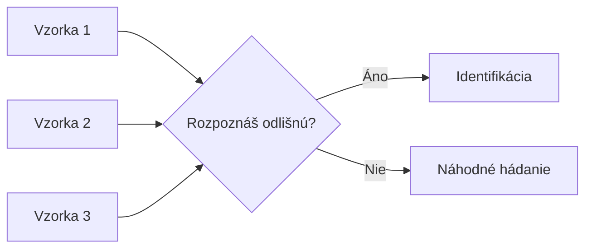
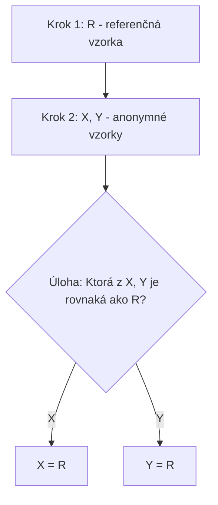
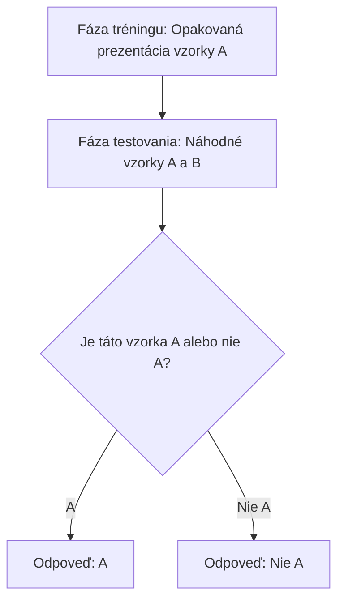
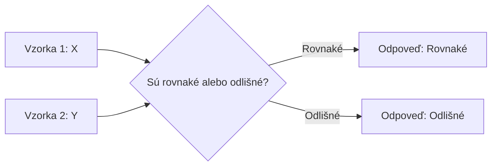
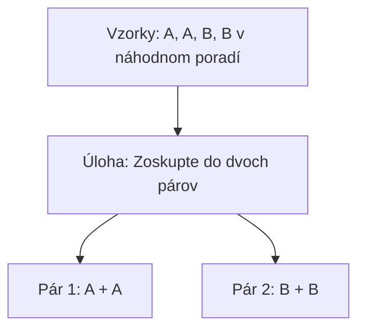
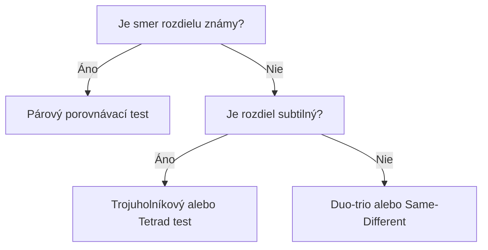

## Úvod

::: {style="text-align: center;"}
### Čo sú diskriminačné metody?

**Testy rozlíšenia** (difference tests) — skupina senzorických techník, ktorých cieľom je zistiť, či existuje **významný senzorický rozdiel** medzi dvoma alebo viacerými vzorkami.

> *„Rozpozná testovateľ rozdiel medzi vzorkami?"*
:::

## Na čo sa používajú?

| Oblast aplikácie | Príklad použitia |
|---|---|
| **Kontrola kvality** | Zmena suroviny, nový dodávateľ |
| **Vývoj produktu** | Optimalizácia receptúry, zníženie cukru/tuku |
| **Stabilita produktu** | Overenie trvanlivosti, porovnanie s referenciou |
| **Výrobný proces** | Zmena parametrov výroby (teplota, čas) |
| **Konzumentské testy** | Porovnanie s konkurenciou, testovanie „me-too" produktu |
| **Výber panelistov** | Skríning tréning senzorového panelu |

## Typy diskriminačných metód

```mermaid
graph TD
    A[Diskriminačné metody] --> B[Trojuholníkový test]
    A --> C[Duo-trio test]
    A --> D[Párový porovnávací test]
    A --> E["A" – "nie A" test]
    A --> F[Test rovnakosti]
    A --> G[Tetrad test]
    A --> H[2-out-of-5 test]
    A --> I[3-AFC]
    A --> J[n-AFC]
```

## Trojuholníkový test

### Princíp

Testovateľovi sa predložia **tri vzorky**, z ktorých sú **dve rovnaké** a **jedna odlišná**. Úlohou je identifikovať **odlišnú vzorku**.



**6 možných kombinácií poradia:** AAB, ABA, BAA, BBA, BAB, ABB

### Kedy použiť

- Keď existujú **dve vzorky** na porovnanie
- Keď sa predpokladá, že rozdiel je **subtilný**
- Keď je potrebná **vysoká citlivosť** pri minimálnom počte vzoriek
- Keď testovateľia sú **cvičení** (trained panel)
- Keď sa testujú **homogénne** výrobky (mlieko, olej, víno)

## Trojuholníkový test – Výpočet

### Binomické rozdelenie

$$P(X = k) = \binom{n}{k} \cdot p^k \cdot (1-p)^{n-k}$$

Kde:
- **n** = počet testovateľov
- **k** = počet správnych odpovedí
- **p** = 1/3 (pravdepodobnosť úspechu pri náhodnom hádaní)

### Kumulatívna pravdepodobnosť

$$P(X \geq k) = \sum_{i=k}^{n} \binom{n}{i} \cdot \left(\frac{1}{3}\right)^i \cdot \left(\frac{2}{3}\right)^{n-i}$$

## Trojuholníkový test – Kritické hodnoty

| n | α = 0.05 | α = 0.01 | α = 0.001 |
|---|---|---|---|
| 10 | 7 | 8 | 9 |
| 15 | 9 | 10 | 12 |
| 20 | 11 | 12 | 14 |
| 25 | 13 | 14 | 16 |
| 30 | 14 | 16 | 18 |
| 35 | 16 | 17 | 19 |
| 40 | 17 | 19 | 21 |
| 45 | 19 | 20 | 22 |
| 50 | 20 | 22 | 24 |
| 60 | 23 | 25 | 27 |
| 70 | 26 | 28 | 30 |
| 80 | 28 | 30 | 32 |
| 90 | 31 | 33 | 35 |
| 100 | 33 | 35 | 37 |

## Duo-trio test

### Princíp

Testovateľ najprv dostane **referenčnú vzorku** (R), potom dve anonymné vzorky. Úlohou je identifikovať, ktorá z anonymných vzoriek je **rovnaká** ako referenčná.



### Výpočet

$$P(X \geq k) = \sum_{i=k}^{n} \binom{n}{i} \cdot \left(\frac{1}{2}\right)^i \cdot \left(\frac{1}{2}\right)^{n-i}$$

**p = 1/2** (pravdepodobnosť správnej odpovede pri náhodnom hádaní)

## Duo-trio test – Kritické hodnoty

| n | α = 0.05 | α = 0.01 |
|---|---|---|
| 10 | 8 | 9 |
| 15 | 11 | 12 |
| 20 | 14 | 15 |
| 25 | 16 | 18 |
| 30 | 19 | 20 |
| 35 | 21 | 23 |
| 40 | 23 | 25 |
| 45 | 25 | 27 |
| 50 | 27 | 29 |
| 60 | 31 | 33 |
| 70 | 34 | 37 |
| 80 | 38 | 40 |
| 90 | 41 | 44 |
| 100 | 44 | 47 |

## Párový porovnávací test

### Princíp

Testovateľ dostane **dve vzorky** a musí určiť, ktorá je **viac intenzívna** v konkrétnej senzorickom atribúte.

> **Dôležité:** Testovateľ musí poznať **smer rozdielu** (napr. sladkosť, horkosť, kyslosť).

### Kedy použiť

- Keď je známy **konkrétny atribút** rozdielu
- Pri **rýchlych screeningových** testoch
- Keď sa testuje **jeden konkrétny atribút**
- Pri **konzumentských** testoch
- Keď je potrebná **maximálna jednoduchosť**

### Výpočet

$$P(X \geq k) = \sum_{i=k}^{n} \binom{n}{i} \cdot \left(\frac{1}{2}\right)^n$$

## Párový porovnávací test – Kritické hodnoty

| n | α = 0.05 | α = 0.01 |
|---|---|---|
| 10 | 9 | 10 |
| 15 | 12 | 13 |
| 20 | 15 | 16 |
| 25 | 18 | 19 |
| 30 | 20 | 22 |
| 35 | 23 | 24 |
| 40 | 25 | 27 |
| 45 | 27 | 29 |
| 50 | 29 | 31 |
| 60 | 33 | 35 |
| 70 | 37 | 39 |
| 80 | 41 | 43 |
| 90 | 44 | 47 |
| 100 | 47 | 50 |

## "A" – "nie A" test

### Princíp

Testovateľ je najprv **cvičený** na rozpoznávanie vzorky „A". Potom dostáva sériu vzoriek a musí pre každú rozhodnúť, či je „A" alebo „nie A".



### Kedy použiť

- Keď je potrebné testovať **rozpoznávanie** (nie len rozdiel)
- Pri **rýchlych kontrolných** testoch (napr. na výrobe)
- Keď je dôležité **zapamätanie si referencie**
- Pri testovaní **komplexných** produktov
- Keď sa testuje **viacero atribútov** naraz

## Test rovnakosti (Same-Different)

### Princíp

Testovateľ dostane **dve vzorky** a musí rozhodnúť, či sú **rovnaké** alebo **odlišné**. Na rozdiel od trojuholníkového testu, testovateľ **nevypisuje** ktorá je odlišná.



### Kedy použiť

- Keď sa testuje **celková podobnosť** (nie konkrétny atribút)
- Pri **rýchlych screeningových** testoch
- Keď testovateľia **nevypisú** ktorá vzorka je odlišná
- Pri testovaní **viacerých atribútov** naraz
- Keď je potrebná **nižšia kognitívna záťaž**

## Tetrad test

### Princíp

Testovateľ dostane **štyri vzorky**, z ktorých sú **dve rovnaké** a **dve odlišné** (napr., AABB). Úlohou je **zoskupiť** vzorky do dvoch párov rovnakých vzoriek.



### Kedy použiť

- Keď je potrebná **vyššia citlivosť** ako pri trojuholníkovom teste
- Pri testovaní **subtilných** rozdielov
- Keď je dôležité **minimalizovať únavu** testovateľov
- Pri **komplexných** produktoch s viacerými atribútmi

## Porovnanie metód

| Metóda | p (náhodný úspech) | Citlivosť | Náročnosť | Rýchlosť | Konzumenti |
|---|---|---|---|---|---|
| **Trojuholníkový** | 1/3 | Vysoká | Vysoká | Stredná | Nie |
| **Duo-trio** | 1/2 | Stredná | Stredná | Stredná | Občas |
| **Párový porovnávací** | 1/2 | Nízka | Nízka | Vysoká | Áno |
| **"A" – "nie A"** | 1/2 | Stredná | Vysoká (tréning) | Vysoká (po tréningu) | Občas |
| **Same-Different** | 1/2 | Stredná | Nízka | Vysoká | Áno |
| **Tetrad** | 1/3 | Vysoká | Stredná | Stredná | Nie |

## Počet testovateľov pre rovnakú silu testu

*(α = 0.05, power = 0.80)*

| Metóda | Odhadovaný počet testovateľov |
|---|---|
| Trojuholníkový | 30–50 |
| Duo-trio | 50–80 |
| Párový porovnávací | 60–100 |
| "A" – "nie A" | 50–80 |
| Same-Different | 50–80 |
| Tetrad | 25–40 |

## Výber správnej metody



## Kritériá výbera

| Kritérium | Odporúčaná metóda |
|---|---|
| Známy smer rozdielu | Párový porovnávací test |
| Subtilný rozdiel, cvičený panel | Trojuholníkový test |
| Subtilný rozdiel, menej cvičený panel | Tetrad test |
| Rýchly screening | Párový porovnávací test |
| Konzumentský test | Párový porovnávací test |
| Komplexný produkt, viac atribútov | "A" – "nie A" test |
| Kontrola kvality na výrobe | "A" – "nie A" test |
| Minimálna kognitívna záťaž | Same-Different test |

## Praktický príklad 1: Trojuholníkový test

**Scénár:** Zmena dodávateľa cukru – testuje sa, či cvičený panel (n = 40) rozpozná rozdiel.

**Výsledky:** 22 testovateľov správne identifikovalo odlišnú vzorku.

$$P(X \geq 22) = \sum_{i=22}^{40} \binom{40}{i} \cdot \left(\frac{1}{3}\right)^i \cdot \left(\frac{2}{3}\right)^{40-i} \approx 0.0032$$

**Záver:** p < 0.01 → **Významný rozdiel**. Zníženie cukru o 30% je senzoricky detekovateľné.

## Praktický príklad 2: Duo-trio test

**Scénár:** Nový dodávateľ kávy – panel 50 menej cvičených testovateľov.

**Výsledky:** 32 testovateľov správne identifikovalo vzorku zhodnú s referenciou.

$$P(X \geq 32) = \sum_{i=32}^{50} \binom{50}{i} \cdot \left(\frac{1}{2}\right)^{50} \approx 0.033$$

**Záver:** p < 0.05 → **Významný rozdiel**. Nový dodávateľ kávy má merateľne mení senzorické vlastnosti.

## Praktický príklad 3: Párový porovnávací test

**Scénár:** Ktorý z dvoch typov medu (lipový vs. akáciový) je sladší? 60 konzumentov.

**Výsledky:** 38 konzumentov označilo lipový med ako sladší.

$$P(X \geq 38) = \sum_{i=38}^{60} \binom{60}{i} \cdot \left(\frac{1}{2}\right)^{60} \approx 0.014$$

**Záver:** p < 0.05 → **Významný rozdiel**. Lipový med je štatisticky významne sladší.

## Záver

Diskriminačné metody sú **nástrojmi prvej línie** v senzorikej analýze.

Výber správnej metody závisí od:

- **Cieľa testu** (screening vs. potvrdenie)
- **Úrovne panelu** (cvičený vs. konzument)
- **Povahy rozdielu** (subtilný vs. výrazný)
- **Dostupných zdrojov** (čas, počet testovateľov)

> Vždy je dôležité **kombinovať** diskriminačné metódy s deskriptívnymi pre kompletný obraz o senzorických vlastnostiach produktu.

## Referencie

- Lawless, H.T. & Heymann, H. (2010). *Sensory Evaluation of Food: Principles and Practices*. Springer.
- Stone, H. & Sidel, J.L. (2004). *Sensory Evaluation Practices*. Elsevier.
