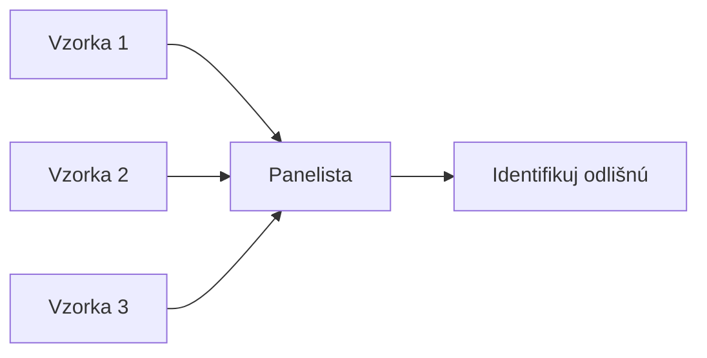
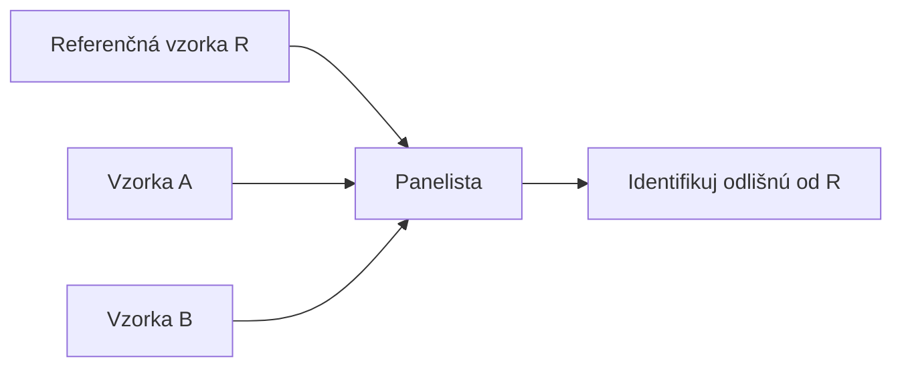

## Prehľad ISO standardov

| ISO Štandard | Názov | Hlavný účel |
|---|---|---|
| ISO 8586:2023 | Výber a tréning hodnotiteľov | Kvalifikácia panelistov |
| ISO 13299:2016 | Metodológia senzorickej analýzy | Všeobecná metodológia |
| ISO 4120:2021 | Trojuholníkový test | Rozlišovanie produktov |
| ISO 5495:2005 | Párový porovnávací test | Rozlišovanie produktov |
| ISO 10399:2017 | Duo-trio test | Rozlišovanie s referenciou |
| ISO 4121:2003 | Škála intenzity | Hodnotenie intenzity |
| ISO 11035:1994 | Identifikácia deskriptorov | Profilová analýza |
| ISO 11036:2020 | Textúrna profilová analýza | Hodnotenie textúry |
| ISO 11136:2014 | Spotrebiteľské testy | Testovanie prijatia |
| ISO 16779:2015 | Časovo intenzívna analýza | Dynamika vnímania |

## Trojuholníkový test (ISO 4120)

### Princíp

Panelista dostane **tri vzorky** – dve rovnaké, jedna odlišná. Úlohou je identifikovat odlišnú vzorku.



### Štatistika

- **H₀:** p = 1/3 (náhodná voľba)
- **H₁:** p > 1/3 (schopnosť rozlišovať)

### Kritické hodnoty (α = 0.05)

| n (panelistov) | Min. správnych |
|---|---|
| 10 | 7 |
| 15 | 9 |
| 20 | 11 |
| 25 | 13 |
| 30 | 15 |
| 36 | 17 |
| 48 | 21 |
| 60 | 25 |

## Duo-trio test (ISO 10399)

### Princíp

Panelista dostane **referenčnú vzorku** a dve neznáme – jedna rovná referencii, jedna odlišná.



### Kritické hodnoty (α = 0.05)

| n (panelistov) | Min. správnych |
|---|---|
| 10 | 8 |
| 15 | 11 |
| 20 | 13 |
| 25 | 16 |
| 30 | 18 |
| 36 | 21 |
| 48 | 27 |
| 60 | 33 |

## Párový porovnávací test (ISO 5495)

### Princíp

Panelista dostane **dve vzorky** a vyberie tú s vyššou intenzitou zvoleného atribútu.

### Kritické hodnoty (dvojitý test, α = 0.05)

| n | Dolná kritická | Horná kritická |
|---|---|---|
| 20 | 6 | 14 |
| 30 | 10 | 20 |
| 40 | 13 | 27 |
| 50 | 16 | 34 |
| 60 | 19 | 41 |

## "A" – "nie A" Test

### Princíp

Panelista sa naučí referenčnú vzorku **"A"**, potom rozhoduje či vzorka podobá "A" alebo nie.

### Kritické hodnoty (α = 0.05)

| n (panelistov) | Min. správnych |
|---|---|
| 10 | 8 |
| 15 | 11 |
| 20 | 13 |
| 25 | 16 |
| 30 | 18 |
| 36 | 21 |
| 48 | 27 |
| 60 | 33 |

## Test rovnakosti (Same-Different)

### Princíp

Panelista dostane **dve vzorky** a rozhodne, či sú rovnaké alebo odlišné.

### Kritické hodnoty (α = 0.05)

| n (panelistov) | Min. správnych |
|---|---|
| 10 | 8 |
| 15 | 11 |
| 20 | 13 |
| 25 | 16 |
| 30 | 18 |
| 36 | 21 |
| 48 | 27 |
| 60 | 33 |

## Tetrad test

### Princíp

Panelista dostane **štyri vzorky** – dve rovnaké a dve odlišné. Úlohou je rozdeliť ich do dvoch skupín po dvoch.

### Kritické hodnoty (α = 0.05)

| n (panelistov) | Min. správnych |
|---|---|
| 24 | 12 |
| 36 | 17 |
| 48 | 21 |
| 60 | 25 |

## Škála intenzity (ISO 4121)

### Typy škál

| Typ škály | Počet bodov | Príklad |
|---|---|---|
| 3-bodová | 3 | Sladké, stredne sladké, nesladké |
| 5-bodová | 5 | Veľmi slabé → veľmi silné |
| 7-bodová | 7 | 1 = veľmi slabé, 7 = veľmi silné |
| 9-bodová | 9 | 1 = veľmi slabé, 9 = veľmi silné |

### Výpočet

```
Priemer: x̄ = Σxi / n
Smerodajná odchýlka: s = √(Σ(xi - x̄)² / (n-1))
95% CI: x̄ ± t(0.025, n-1) × s/√n
```

## JAR škála (Just-About-Right)

### Princíp

Panelista hodnotí, či je intenzita atribútu príliš nízka, príliš vysoká, alebo práve správna.

| Hodnotenie | Popis |
|---|---|
| 1 | Príliš nízka (Príliš málo) |
| 2 | Trochu nízka |
| 3 | Práve správna (JAR) |
| 4 | Trochu vysoká |
| 5 | Príliš vysoká (Príliš veľa) |

### Penalizácia (Penalty Analysis)

```
Penalty = Priemer liking pre "Príliš nízka" - Priemer liking pre "JAR"
```

## Hedonická škála (9-bodová)

| Hodnotenie | Popis |
|---|---|
| 9 | Výnimočne sa mi páči |
| 8 | Veľmi sa mi páči |
| 7 | Mierne sa mi páči |
| 6 | Trochu sa mi páči |
| 5 | Ani sa mi páči, ani sa mi nepáči |
| 4 | Trochu sa mi nepáči |
| 3 | Mierne sa mi nepáči |
| 2 | Veľmi sa mi nepáči |
| 1 | Výnimočne sa mi nepáči |

## Kritické hodnoty – Trojuholníkový test

| n | α = 0.10 | α = 0.05 | α = 0.01 |
|---|---|---|---|
| 10 | 6 | 7 | 8 |
| 15 | 8 | 9 | 11 |
| 20 | 10 | 11 | 13 |
| 25 | 12 | 13 | 15 |
| 30 | 13 | 15 | 17 |
| 36 | 15 | 17 | 19 |
| 48 | 19 | 21 | 24 |
| 60 | 23 | 25 | 28 |

## Kritické hodnoty – Duo-trio test

| n | α = 0.10 | α = 0.05 | α = 0.01 |
|---|---|---|---|
| 10 | 7 | 8 | 9 |
| 15 | 10 | 11 | 12 |
| 20 | 12 | 13 | 15 |
| 25 | 14 | 16 | 17 |
| 30 | 16 | 18 | 20 |
| 36 | 19 | 21 | 23 |
| 48 | 25 | 27 | 29 |
| 60 | 30 | 33 | 36 |

## Aplikácie – Ktorú metódu použiť

| Situácia | Odporúčaná metóda |
|---|---|
| Zistiť, či sa produkty líšia | Trojuholníkový test |
| Ktorý produkt je intenzívnejší | Párový porovnávací test |
| Overiť rozdiel od referencie | Duo-trio test |
| Rýchly screening | "A" – "nie A" test |
| Overiť konzistenciu | Test rovnakosti |
| Porovnať viac produktov | Tetrad test |

## Záver

ISO štandardy poskytujú **robustný rámec** pre senzorickú analýzu. Správna voľba metódy závisí od:

- Cieľa testovania (rozlišovanie vs. deskripcia vs. prijatie)
- Typu produktu a atribútov
- Dostupných zdrojov
- Požadovanej štatististickej sily

---

*Prehľad pripravený pre potreby SAP – Senzorická Analýza Potravín*
