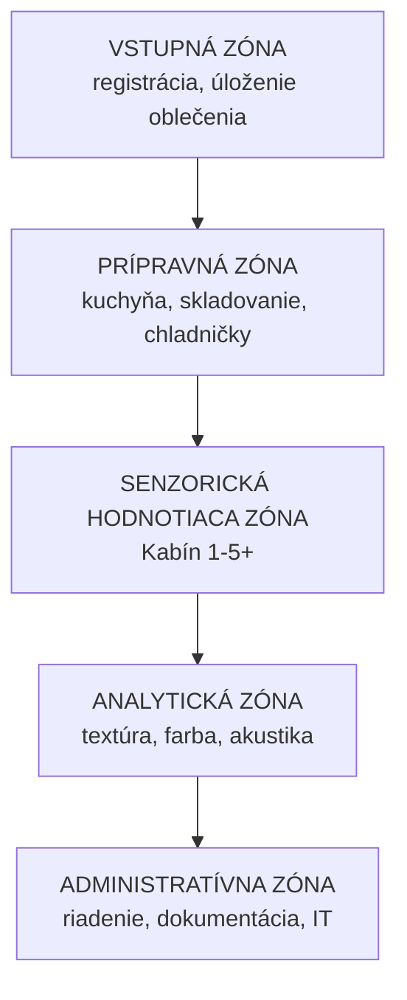
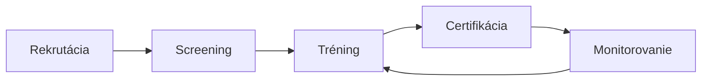

## Požiadavky ISO 8586

Podľa **ISO 8586:2023** musí senzorické laboratórium spĺňať:

- **Oddelenie** prípravnej zóny od hodnotiaceho priestoru
- **Individuálne hodnotiace kabíny** pre každého panelistu
- **Kontrolované environmentálne podmienky** (teplota, vlhkosť, osvetlenie, vzduch)
- **Eliminácia rušivých vplyvov** (zápachy, hluk, vizuálny stres)
- **Dostatok priestoru** pre pohodlné hodnotenie

## Layout laboratória

### Oddelenie prípravnej a hodnotiacej zóny

| Kritérium | Prípravná zóna | Hodnotiaca zóna |
|-----------|---------------|-----------------|
| Vzduchová výmena | Samostatná | Samostatná |
| Zápachy | Pripustné | Neprípustné |
| Osvetlenie | Funkčné | Kontrolované (biele) |
| Teplota | 18–24°C | 20–22°C |
| Hluk | Tolerovaný | Tlumený |

## Podmienky prostredia

### Teplota

| Parameter | Hodnota | Tolerancia |
|-----------|---------|------------|
| Teplota vzduchu | 20–22°C | ±1°C |
| Teplota pracovných plôch | 20–22°C | ±1°C |
| Teplota vzoriek | Špecifická pre produkt | ±2°C |

### Vlhkosť

| Parameter | Hodnota | Tolerancia |
|-----------|---------|------------|
| Relatívna vlhkosť | 40–60% | ±5% |
| Absolútna vlhkosť | 7–11 g/kg | — |

### Osvetlenie

| Parameter | Hodnota |
|-----------|---------|
| Osvetlenie na pracovnej ploche | 500–1000 lux |
| Farba osvetlenia | Biele (D65), CRI ≥ 90 |
| Rovnomernosť | ≥ 0.7 |

### Vzduchová výmena a akustika

| Parameter | Hodnota |
|-----------|---------|
| Výmena vzduchu | 6–12 krát/hodinu |
| Rýchlosť prúdenia | < 0.2 m/s |
| Hladina hluku | < 40 dB(A) |
| Reverberačný čas | < 0.5 s |

## Senzorické kabíny

| Parameter | Špecifikácia |
|-----------|-------------|
| Počet kabín | 5–15 (podľa velikosti panelu) |
| Rozstup medzi kabínami | ≥ 1.0 m |
| Šírka kabíny | ≥ 0.8 m |
| Hĺbka kabíny | ≥ 0.8 m |
| Materiály | Nerdzavejúca oceľ, sklo, plast |
| Povrch | Ľahko čistiteľný, odolný proti zápachom |
| Osvetlenie | Individuálne kontrolované |
| Komunikácia | Interkom alebo tablet |

## Príprava vzoriek

### Identifikácia a kódovanie

| Parameter | Špecifikácia |
|-----------|-------------|
| Kódovanie | Náhodné trojciferné kódy |
| Generovanie | Náhodný generátor (RAND) |
| Unikátnosť | Každá vzorka má jedinečný kód |
| Dvojité slepé kódovanie | Pre testy s kontrolou |

### Porcie a podávanie

| Typ produkt | Teplota podávania |
|-------------|------------------|
| Studené nápoje | 4–8°C |
| Teplé nápoje | 60–65°C |
| Mäsové produkty | 60–70°C |
| Pečivo | 20–22°C |
| Mliečne produkty | 4–8°C |
| Sladkosti | 20–22°C |

### Počet vzoriek na panelistu

| Typ testu | Maximálny počet vzoriek |
|-----------|------------------------|
| Deskriptívna analýza | 4–6 |
| Hedonický test | 6–8 |
| Test rozdielov | 3–4 |
| Časovo-intenzívna analýza | 4–6 |

## Panelisti

### Výber a tréning (ISO 8586)

### Počet panelistov

| Typ testu | Počet panelistov |
|-----------|-----------------|
| Trénovaný panel (deskriptívna) | 8–12 |
| Trénovaný panel (test rozdielov) | 12–24 |
| Spotrebiteľský test (hedonický) | 100+ |
| Spotrebiteľský test (preferencie) | 150+ |
| Expertný panel | 3–5 |

### Kalibrácia a monitorovanie

| Parameter | Frekvencia |
|-----------|-----------|
| Test citlivosti | Každých 6 mesiacov |
| Test reprodukovateľnosti | Každých 3 mesiace |
| Test diskriminácie | Každých 6 mesiacov |
| Kalibrácia s referenciami | Každý mesiac |
| Spätná väzba | Po každom teste |

## Hygiena a bezpečnosť

### HACCP princípy

1. Analýza nebezpečenstva
2. Kritické kontrolné body (CCP)
3. Kritické limity
4. Monitorovanie
5. Korekčné opatrenia
6. Verifikácia
7. Dokumentácia

### Alergény

| Alergén | Opatrenie |
|---------|-----------|
| Gluten | Samostatná príprava, označenie |
| Mlieko | Samostatná príprava, označenie |
| Vajce | Samostatná príprava, označenie |
| Orechy | Samostatná príprava, označenie |
| Sója | Samostatná príprava, označenie |
| Ryby | Samostatná príprava, označenie |

## Dokumentácia

### Protokoly a záznamy

| Dokument | Frekvencia | Doba uchovania |
|----------|-----------|----------------|
| Testovací protokol | Každý test | 5 rokov |
| Záznam z testu | Každý test | 5 rokov |
| Záznam z prípravy | Každá príprava | 2 roky |
| Záznam z čistenia | Každé čistenie | 2 rokov |
| Záznam z kalibrácie | Podľa plánu | 5 rokov |

### Kalibrácia zariadení

| Zariadenie | Frekvencia |
|-----------|-----------|
| Termometry | Každých 6 mesiacov |
| Váhy | Každých 6 mesiacov |
| Meradlá | Každých 12 mesiacov |
| Chladničky/mrazničky | Každý mesiac |
| Osvetlenie | Každých 12 mesiacov |

## Záver

Dodržiavanie podmienok ISO 8586, ISO 13299 a ďalších štandardov je **nevyhnutné** pre:
- Spoľahlivé výsledky
- Reprodukovateľnosť
- Validitu dát

---

*Dokument pripravený pre potreby SAP – Senzorická Analýza Potravín*
