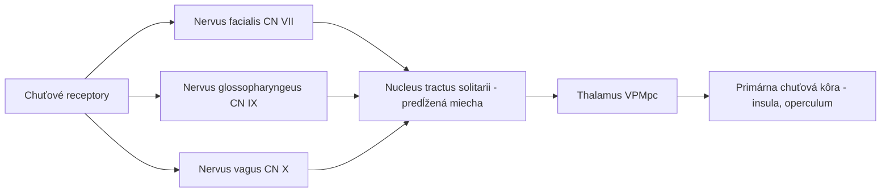
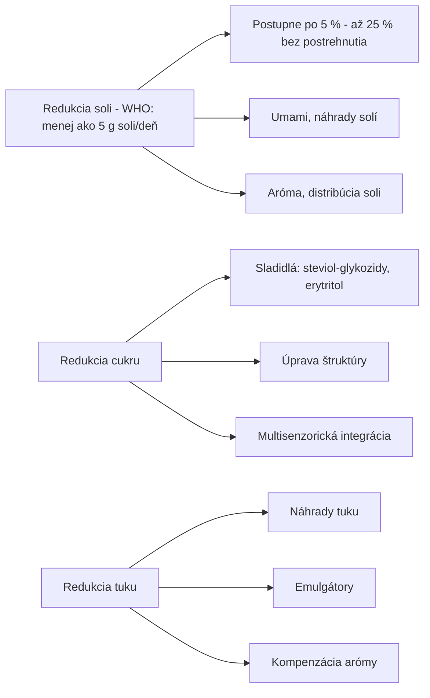

## Úvod do senzoriky

::: {style="font-size: 0.9em"}
**Senzorická analýza** je vedná disciplína, ktorá študuje vnímanie ľudskými zmyslami – chuťou, čuchom, zrakom, hmatom a sluchom – v kontexte potravín a iných produktov.
:::

- Využíva vedecky overiteľné metódy na kvantifikáciu subjektívnych vnemov
- Premosťuje fyziologické reakcie a spotrebiteľské preferencie
- Kľúčová pre NPD, kontrolu kvality, redukciu nákladov a marketing

> **Cieľ prezentácie:** Prehľad overených poznatkov o vnímaní chutí

::: {.callout-warning}
Revízia 09/2026: neoveriteľné citácie z rokov 2020–2023 boli odstránené a nahradené overenými zdrojmi (PubMed, DOI).
:::

## História senzoriky

| Obdobie | Vývojový milník |
|---------|-----------------|
| 1940s | Vojnový výskum (US Army Quartermaster); trojuholníkový test |
| koniec 1940s – 1950s | Flavor Profile Method; 9-bodová hedonická škála (1957) |
| 1960s | Texture Profile Method (1963) |
| 1970s | QDA (Stone et al., 1974); normalizácia ASTM E18, ISO/TC 34/SC 12 |
| 1980s–1990s | Spectrum, Free Choice Profiling, Thurstonovské modely |
| 2000s | Rýchle metódy (Flash Profile, CATA), TDS (Pineau et al., 2009) |
| 2010s | TCATA (2016), tetrad, genetika a neurovedy |
| 2020s | Virtuálna realita, biometria, strojové učenie |

## Fyziológia chutí

### Chuťové bunky a receptory

- Rádovo **tisíce** chuťových pohárikov (často uvádzané ~2 000–8 000, veľká variabilita)
- Na jazyku, podnebí, v hltane a na hrtanovej príklopke

| Typ bunky | Funkcia | Obnova |
|-----------|---------|-------------|
| Typ I | Podporné bunky (glia-like) | ~1–2 týždne |
| Typ II | Sladké, horké, umami (GPCR) | ~1–2 týždne |
| Typ III | Kyslé (a averzívne vysoké koncentrácie solí) | až ~3 týždne |

### Prenos signálu

## Päť základných chutí

| Chuť | Typický stimul | Receptory | Mechanizmus |
|------|-------------------|-----------|-------|
| **Sladká** | Sacharóza, fruktóza | T1R2 + T1R3 | GPCR |
| **Slaná** | NaCl | ENaC (nízke koncentrácie) | Iónový kanál |
| **Kyslá** | Kyselina citrónová, HCl | **OTOP1** | Protónový kanál |
| **Horká** | Kofeín, chinín, PROP | **T2R (TAS2R)**, ~25 receptorov | GPCR |
| **Umami** | Glutamát, inozinát | T1R1 + T1R3 (mGluR4) | GPCR |

> **Kapsaicín nie je horký** – spôsobuje pálivosť (TRPV1). Kandidáti na ďalšie chute: *oleogustus* (Running et al., 2015), *vápnik* (T1R3; Tordoff et al., 2012), *kokumi*.

## Interakcie chuti a čuchu

### Retronazálny čuch

- „Chuť" jedla = **flavor**: chuť + retronazálny čuch + trigeminálne vnemy
- Aromatické látky prúdia z úst cez nosohltan k čuchovému epitelu

**Overené poznatky:**

- **Small et al. (2005)**, *Neuron* – orto- vs. retronazálna vôňa aktivuje čiastočne odlišné oblasti mozgu ([DOI](https://doi.org/10.1016/j.neuron.2005.07.022))
- **Spence (2015)**, *Flavour* – populárne „80 % chuti je čuch" **nemá empirický základ**

## Genetické variácie

### PROP, TAS2R38 a supertasteri

| Fenotyp (PROP) | % populácie (orient.) | Typický genotyp TAS2R38 |
|---------|-------------|-------------------|
| Supertaster | ~15–25 % | často PAV/* – genotyp fenotyp **neurčuje** |
| Medium taster | ~50 % | rôzne |
| Non-taster | ~25–30 % | prevažne AVI/AVI |

- **Kim et al. (2003)**, *Science* – TAS2R38 vysvetľuje 55–85 % variability citlivosti na PTC ([DOI](https://doi.org/10.1126/science.1080190))
- **Hayes et al. (2008)**, *Chem. Senses* – supertasting závisí aj od iných faktorov než TAS2R38 ([DOI](https://doi.org/10.1093/chemse/bjm084))
- **Garneau et al. (2014)** – hustota papíl horkosť PROP nepredikuje ([DOI](https://doi.org/10.3389/fnint.2014.00033))

### Ďalšie genetické faktory

- **CD36** – citlivosť na mastné kyseliny
- **T1R1/T1R3, T1R2** – citlivosť na umami a sladkosť
- **GNAT3** – α-**gustducín** (gustín = karboanhydráza VI, *CA6*)

## Mikrobióm a chuť ❓

- Dôkazy u ľudí sú zatiaľ prevažne **asociačné**
- Zvierací model: vysokotuková strava zvýšila expresiu Tas2r138/Tas2r116 v **hrubom čreve**, antibiotiká tomu zabránili (Caremoli et al., 2023, *Nutrients*, [DOI](https://doi.org/10.3390/nu15194145))
- Tvrdenia „probiotiká menia chuťové preferencie" nie sú dostatočne podložené

## Neurobiológia odmeny

| Oblasť mozgu | Funkcia |
|--------------|---------|
| Insula / frontálne operculum | Primárna chuťová kôra |
| Orbitofrontálna kôra | Integrácia chuti a vône, príjemnosť |
| Nucleus accumbens / striatum | Odmena a motivácia |
| Amygdala | Emočné asociácie |
| Hippocampus | Pamäť na chuťové zážitky |

- **Small et al. (2003)**, *NeuroImage* – uvoľnenie dopamínu v dorzálnom striate úmerne príjemnosti jedla
- **Thanarajah et al. (2019)**, *Cell Metab.* – okamžité (orosenzorické) aj oneskorené (post-ingestívne) uvoľnenie dopamínu ([DOI](https://doi.org/10.1016/j.cmet.2018.12.006))

## Psychologické faktory a kontext

- **Očakávanie:** vyššia cena vína → vyššia príjemnosť aj aktivita mediálnej OFC (Plassmann et al., **2008**, *PNAS*, [DOI](https://doi.org/10.1073/pnas.0706929105))
- **Kontext:** farba nádoby, hudba, osvetlenie ovplyvňujú hodnotenie (prehľady Ch. Spencea)
- **Stres a nálada:** výsledky štúdií sú nejednotné ❓

## Metodologické inovácie

### Virtuálna realita (VR)

| Aplikácia | Výhody |
|-----------|--------|
| Simulácia reštaurácie | Kontrola premenných, nižšie náklady |
| Testovanie obchodu | Realistickejšie nákupné správanie |
| Domáci kontext | Vyššia ekologická validita |
| Tréning panelistov | Konzistentnosť tréningu |

Overená štúdia: **Stelick et al. (2018)**, *J. Food Sci.* – syr hodnotený vo VR „maštali" bol vnímaný ako pikantnejší ([DOI](https://doi.org/10.1111/1750-3841.14275))

### Umelá inteligencia

- Predikcia senzorických vlastností z chemických/spektroskopických dát
- NLP analýza voľných popisov a recenzií → [SaIT cvičenie 11b](https://senzorika.github.io/SaIT/teoria/cvicenie11b.html)
- Optimalizácia receptúr, sledovanie výkonnosti panelu

### Biometrické senzory

| Senzor | Meraná veličina | Aplikácia |
|--------|-----------------|-----------|
| EDA | Kožná vodivosť | Emočné vzrušenie |
| HRV | Variabilita srdcového rytmu | Stres, pozornosť |
| Eye tracking | Pohyb očí, fixácie | Pozornosť, preferencia |
| EMG | Svalové napätie | Mimika, reakcia na chuť |
| fNIRS | Oxygenácia hemoglobínu | Aktivácia mozgovej kôry |

## Aplikácie v potravinárskom priemysle

### Redukcia soli, cukru a tuku

- Soľ: **Girgis et al. (2003)**, *Eur. J. Clin. Nutr.* – 25 % menej soli v chlebe bez postrehnutia ([DOI](https://doi.org/10.1038/sj.ejcn.1601583))
- Cukor: **Hutchings, Low & Keast (2019)**, *Crit. Rev. Food Sci. Nutr.* ([DOI](https://doi.org/10.1080/10408398.2018.1450214))

### Ďalšie aplikácie

- **Clean label** – právne nedefinovaný pojem; jednoduché, zrozumiteľné suroviny
- **Plant-based produkty** – maskovanie strukovinových, horkých a trpkých tónov
- **Shelf-life** – senzorická stabilita počas trvanlivosti

## Záver

::: {style="font-size: 0.9em"}
Vnímanie chutí je multidisciplinárny výskumný objekt na pomedzí fyziológie, genetiky, psychológie a neurovedy.
:::

**Kľúčové poznatky:**
- Flavor = chuť + retronazálny čuch + trigeminálne vnemy
- Receptory: T2R (horké), OTOP1 (kyslé); TAS2R38 a variabilita vnímania
- Neurobiológia odmeny (dopamín)
- Nové metódy (VR, biometria, AI)

**Pozor:** populárne čísla (napr. „80 % chuti je čuch") často nemajú zdroj – vždy overiť primárnu literatúru.

---

*Prehľad pripravený pre potreby SAP – Senzorická Analýza Potravín*

## Precvič v R – SaIT {.smaller}

Praktické cvičenia k tejto téme v repozitári [SaIT – Senzometria v R](https://github.com/senzorika/SaIT):

| Téma | Cvičenie SaIT |
|---|---|
| Koncentrácia vs. vnímaná intenzita (inštrumentálne × senzorické dáta) | [6 – Korelácia a lineárna regresia](https://senzorika.github.io/SaIT/teoria/cvicenie06.html) |
| Porovnanie hodnotení v rôznych kontextoch | [5a – Normalita a porovnanie dvoch vzoriek](https://senzorika.github.io/SaIT/teoria/cvicenie05a.html) |
| Voľné popisy a recenzie spotrebiteľov (NLP) | [11b – Text mining a analýza sentimentu](https://senzorika.github.io/SaIT/teoria/cvicenie11b.html) |
| Rozpoznateľnosť redukcie soli/cukru, test podobnosti | [13 – Thurstonov model a d′](https://senzorika.github.io/SaIT/teoria/cvicenie13.html) |
| Optimalizácia sladkosti (JAR) | [12 – JAR škála a radarový graf](https://senzorika.github.io/SaIT/teoria/cvicenie12.html) |

Prednášky: [Úvod do senzometrie a R](https://senzorika.github.io/SaIT/prezentacie/sk/01_uvod.html)

::: {.callout-note}
Obsah bol v 09/2026 overený a opravený — pozri [Overenie zdrojov](../overenie/overenie_zdrojov.md).
:::
