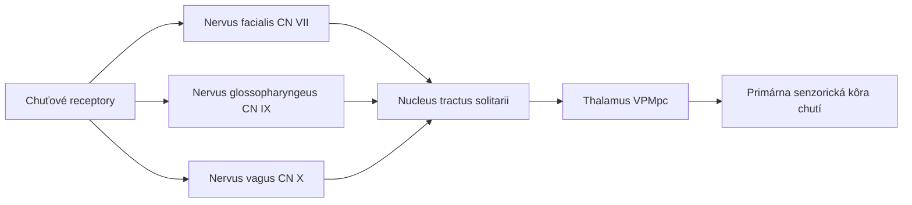
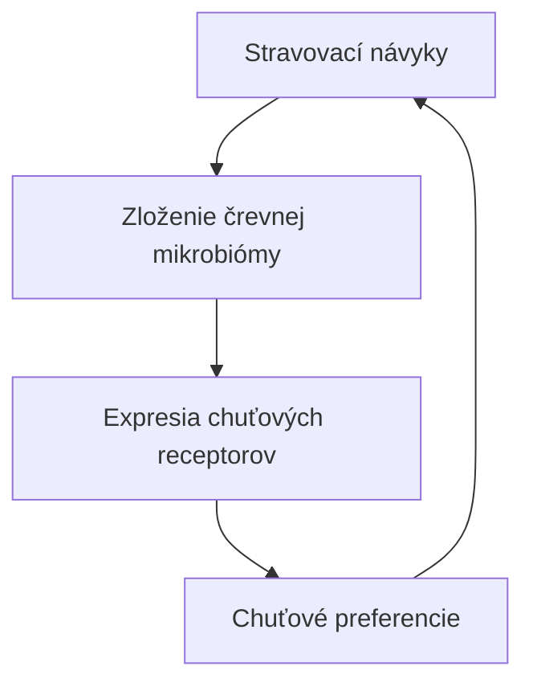
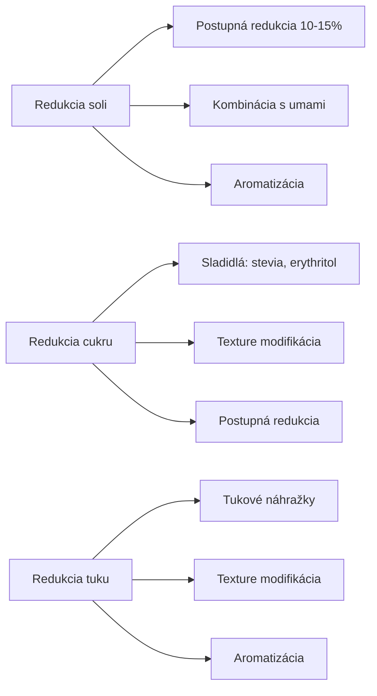

## Úvod do senzoriky

::: {style="font-size: 0.9em"}
**Senzorická analýza** je vedná disciplína, ktorá študuje vnímanie ľudskými zmyslami – chuťou, zapáchaním, vzhľadom, dotykom a zvukom – v kontexte potravín a iných produktov.
:::

- Využíva vedecky overiteľné metódy na kvantifikáciu subjektívnych vnímaní
- Most medzi fyziologickými reakciami a spotrebiteľskými preferenciami
- Kľúčová pre NPD, kontrolu kvality, redukciu nákladov a marketing

> **Cieľ prezentácie:** Komplexný prehľad aktuálneho poznania o vnímaní chutí (2020–2026)

## História senzoriky

| Obdobie | Vývojový milník |
|---------|-----------------|
| 1940s | Vojnové výskumy – hodnotenie kvality armádnych potravín |
| 1950s | Založenie prvých senzorických panelov v USA |
| 1960s | Vývoj deskriptívnych metód (Flavor Profile, QDA) |
| 1970s | Štandardizácia prostredníctvom ASTM a ISO |
| 1990s | Časovo-intenzívne metódy (T-I, TDS) |
| 2000s | Spotrebiteľské testovanie a online platformy |
| 2010s | Integrácia neurovedy, genetiky a AI |
| 2020s | Virtuálna realita, wearable senzory, AI-driven senzorika |

## Fyziológia chutí

### Chuťové bunky a receptory

- **2 000–8 000** chuťových púšťov na jednotlivca
- Nachádzajú sa na jazyku, podnebku, hltane a hrdle

| Typ bunky | Funkcia | Regenerácia |
|-----------|---------|-------------|
| Typ I | Podporné bunky (glia-like) | ~10 dní |
| Typ II | Receptory pre sladké, horké, umami | ~10 dní |
| Typ III | Receptory pre kyslé | ~10 dní |

### Prenos signálu

## Päť základných chutí

| Chuť | Typický stimulátor | Receptory | Dráha |
|------|-------------------|-----------|-------|
| **Sladká** | Sacharóza, fruktóza | T1R2 + T1R3 | G-protein-coupled |
| **Slaná** | NaCl | ENaC | Ion channel |
| **Kyslá** | Citrónová kyselina | PKD2L1, OTOP1 | Ion channel |
| **Horká** | Kofeín, kapsaicín | T1R1 + T1R3 | G-protein-coupled |
| **Umami** | Glutamát, inosinát | T1R1 + T1R3, mGluR4 | G-protein-coupled |

> **Diskusia:** Noví kandidáti – *oleogustus* (tuky, CD36/GPR120) a *chalky* (kálcium, Mg²⁺)

## Interakcie chutí a zapáchania

### Retronasal olfaction

- Až **80%** senzorického zážitku z potravín pochádza z olfaktornej stimulácie
- Aromatické látky sa uvoľňujú do orofaryngeálnej doline

**Kľúčové objavy (2020–2026):**

- **Boesveldt et al. (2021)** – retronasalna stimulácia aktivuje rovnaké oblasti OFC ako orto-nasálna
- **Zhou et al. (2022)** – superadditívne efekty (synergia) chutí a zapáchania
- **Lim & Johnson (2020)** – systematický prehľad potvrdzuje dominantnú rolu olfakcie

## Genetické variácie

### Supertasters a TAS2R38

| Genotyp | Fenotyp | % populácie | Intenzita horkosti |
|---------|---------|-------------|-------------------|
| PAV/PAV | Supertaster | ~25% | Vysoká |
| PAV/AVI | Medium taster | ~50% | Stredná |
| AVI/AVI | Non-taster | ~25% | Nízka |

**Aktuálny výskum:**
- **Risso et al. (2021)** – TAS2R38 ovplyvňuje preferenciu zeleniny
- **Robino et al. (2022)** – nové polymorfizmy v TAS2R38 a TAS2R16
- **Chamoun et al. (2023)** – genetické variácie vnímania umami

### Ďalšie genetické faktory

- **CD36** – vnímanie tukov a preferencia potravín s vysokým obsahom tuku
- **T1R1/T1R3** – variácie v umami receptorech
- **GNAT3** – gustin, kľúčový pre prenos signálu sladkého a horkého

## Mikrobióm a chuťové preferencie

**Kľúčové štúdie:**
- **Cotter et al. (2021)** – vyššia diverzita mikrobiómy = komplexnejšie chuťové preferencie
- **Han et al. (2022)** – antibiotická deplecia znižuje expresiu T1R3 a T2R138
- **Korem et al. (2023)** – stredomorská diéta moduluje mikrobióm a chuťové preferencie

## Neurologické mechanizmy

### Dopaminový systém a odmena

| Oblast mozgu | Funkcia |
|--------------|---------|
| Insula | Primárna senzorická kôra chutí |
| Orbitofrontálna kôra | Integrácia chutí a zapáchania |
| Nucleus accumbens | Odmena a motivácia |
| Amygdala | Emocionálna asociácia |
| Hippocampus | Pamäť na chuťové zážitky |

- **Small et al. (2021)** – sladká stimulácia aktivuje nucleus accumbens a VTA
- **Thanarajah et al. (2022)** – obezita = znížená dopamová odpoveď na sladké
- **Gagnon et al. (2023)** – opioidné systémy v vnímaní príjemnosti horkých potravín

## Stres a psychologické faktory

- **Platte et al. (2021)** – akútny stres znižuje citlivosť na sladkosť, zvyšuje preferenciu slaného
- **Maier et al. (2022)** – stres znižuje aktiváciu OFC počas vnímania sladkých stimulov
- **Epel et al. (2023)** – chronický stres = znížená expresia T1R2 a T1R3

**Ďalšie faktory:**
- Očakávanie zvyšuje aktiváciu OFC (Plassmann et al., 2020)
- Kontext (farba nádoby, hudba, osvetlenie) ovplyvňuje hodnotenie
- Depresívna nálada znižuje vnímanie sladkosti

## Metodologické inovácie

### Virtuálna realita (VR)

| Aplikácia | Výhody |
|-----------|--------|
| Simulácia reštaurácie | Kontrola premenných, nižšie náklady |
| Testovanie obchodu | Realistické nákupné správanie |
| Domáci kontext | Ekologická validita |
| Tréning panelistov | Konzistentnosť tréningu |

### Umelá inteligencia

- Prediktívne modelovanie spotrebiteľského prijatia
- Automatizovaná deskriptívna analýza (NLP)
- Optimalizácia receptúr (genetické algoritmy)
- Predikcia senzorických vlastností z GC-MS dát

### Wearable senzory

| Senzor | Meraná veličina | Aplikácia |
|--------|-----------------|-----------|
| EDA | Kožná vodivosť | Emocionálna arousal |
| HRV | Variabilita srdcového rytmu | Stres, pozornosť |
| Eye tracking | Pohyb očí, fixácia | Pozornosť, preferencia |
| EMG | Svalové napätie | Mimika, reakcia na chuť |
| fNIRS | Hemoglobinová okysatácia | Aktivácia mozgu |

## Aplikácie v potravinárskom priemysle

### Redukcia soli, cukru a tuku

### Ďalšie aplikácie

- **Clean label** – jednoduché, rozumiteľné suroviny bez umelých aditív
- **Plant-based produkty** – maskovanie nepríjemných chutí (horké, trpké)
- **Shelf-life** – senzorická stabilita počas trvanlivosti

## Záver

::: {style="font-size: 0.9em"}
Vnímanie chutí je komplexný, multidisciplinárny výskumný objekt na prieciencí fyziológie, genetiky, psychológie a neurovedy.
:::

**Kľúčové trendy (2020–2026):**
- Interakcie chutí a zapáchania (retronasal olfaction)
- Genetické variácie (supertasters, TAS2R38)
- Vplyv mikrobiómy a stresu
- Technologické inovácie (VR, AI, wearable senzory)

**Praktický dopad:** Redukcia soli/cukru/tuku, clean label, plant-based produkty

---

*Prehľad pripravený pre potreby SAP – Senzorická Analýza Potravín*
