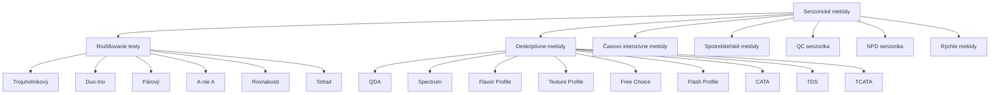

## Klasifikácia senzorických metód

## Rozlišovacie testy

### Prehľad metód

| Test | Vzorky | p (náhodná) | Min. panelistov | Citlivosť |
|------|--------|-------------|-----------------|-----------|
| Trojuholníkový | 3 | 1/3 | 18 | Vysoká |
| Duo-trio | 3 (1 ref.) | 1/2 | 16 | Stredná |
| Párový | 2 | 1/2 | 20 | Nízka |
| A – nie A | 1 (+ref.) | 1/2 | 16 | Nízka |
| Rovnakosti | 2 | 1/2 | 16 | Nízka |
| Tetrad | 4 | 1/3 | 24 | Vysoká |

### Kedy použiť ktorý test

| Kritérium | Trojuholníkový | Duo-trio | Párový | A-nie A | Rovnakosti | Tetrad |
|---|---|---|---|---|---|---|
| Citlivosť | Vysoká | Stredná | Nízka | Nízka | Nízka | Vysoká |
| Náročnosť | Vysoká | Stredná | Nízka | Nízka | Nízka | Vysoká |
| Rýchlosť | Stredná | Stredná | Vysoká | Vysoká | Vysoká | Stredná |
| Screening | Nie | Nie | Áno | Áno | Áno | Nie |
| Referencia | Nie | Áno | Nie | Áno | Nie | Nie |

## Deskriptívne metódy

### QDA (Quantitative Descriptive Analysis)

- **Panelisti:** 8–12 trénovaných
- **Tréning:** 60–90 hodín
- **Atribúty:** 10–30
- **Škála:** Lineárna (15 cm)
- **Analýza:** ANOVA, PCA

### Porovnanie deskriptívnych metód

| Metóda | Panelisti | Tréning | Flexibilita | Reprodukovateľnosť |
|--------|-----------|---------|-------------|---------------------|
| QDA | 8–12 | 60–90 h | Stredná | Vysoká |
| Spectrum | 8–12 | 60–90 h | Nízka | Vysoká |
| Flavor Profile | 4–6 | 40–60 h | Stredná | Stredná |
| Texture Profile | 8–12 | 60–90 h | Nízka | Vysoká |
| Free Choice | 10–15 | Minimálna | Vysoká | Nízka |
| Flash Profile | 10–15 | Minimálna | Vysoká | Nízka |
| CATA | 50–100 | Minimálna | Stredná | Stredná |

## Časovo intenzívne metódy

### Time-Intensity (TI)

- Sleduje intenzitu **jedného atribútu** v čase
- **Parametre:** I_max, T_max, T_total, AUC
- **Panelisti:** 10–15, tréning 20–30 hodín

### Temporal Dominance of Sensations (TDS)

- Sleduje **dominantný atribút** v čase
- **Panelisti:** 10–15, tréning 20–30 hodín
- **Atribúty:** 5–10
- **Signifikantnosť:** % > P_chance = 1/m + 1.645 × √((1/m)(1-1/m)/n)

### TCATA

- Sleduje **všetky aktívne atribúty** v čase
- Kombinácia prístupov TI a TDS

## Spotrebiteľské metódy

### Hedonické testy

- **Spotrebiteľi:** 100–200
- **Škála:** 9-bodová hedonická
- **% Prijatie** = (odpovede ≥ 6) / n × 100
- **% Odmietnutie** = (odpovede ≤ 4) / n × 100

### Preference Mapping

- Kombinuje hedonicke dáta s deskriptívnymi dátami
- Vytvára preferenčné mapy (PCA, PLS)
- Umožňuje segmentáciu spotrebiteľov

### Conjoint Analysis

- Identifikuje dôležité atribúty
- Simuluje trhové správanie
- Part-worth utilities

### JAR škála

- 5-bodová škála (príliš nízka → práve správna → príliš vysoká)
- Penalty analysis pre optimalizáciu

## QC senzorika

### Go/No-Go testy

- **Panelisti:** 4–6
- **Rozhodnutie:** Binárne (Go/No-Go)
- **Frekvencia:** Každá dávka
- Rýchly a jednoduchý

### Senzorická špecifikácia

| Komponent | Príklad |
|-----------|---------|
| Atribút | Sladkosť |
| Škála | 9-bodová |
| Cieľová hodnota | 6.5 |
| Tolerancia | 6.0–7.0 |
| Prahová hodnota | 6.0 |

### Monitorovanie kvality

| Metóda | Princíp |
|--------|---------|
| Kontrolné grafy | Sledovanie trendov |
| CUSUM | Kumulatívny súčet |
| EWMA | Exponenciálne vážený priemer |
| Shewhart | Kontrolné limity |

## NPD senzorika

### Fázy vývoja

| Fáza | Cieľ | Metóda |
|------|------|--------|
| Koncept | Overenie konceptu | Spotrebiteľské testy |
| Prototyp | Optimalizácia | Deskriptívna analýza |
| Pilot | Validácia | Rozlišovacie testy |
| Produkcia | Implementácia | QC senzorika |

### Ďalšie NPD metódy

- **Benchmarking** – porovnanie s konkurenciou
- **Response Surface Methodology** – systematická optimalizácia
- **Shelf-life testing** – senzorická stabilita
- **Claim substantiation** – overenie tvrdení
- **Cost reduction** – identifikácia úspor

## Rýchle metódy

### Prehľad

| Metóda | Panelisti | Tréning | Výhody |
|--------|-----------|---------|--------|
| Flash Profile | 10–15 | Minimálna | Veľmi rýchly |
| CATA | 50–100 | Minimálna | Jednoduchý |
| Sorting | 10–15 | Minimálna | Rýchly |
| Napping | 10–15 | Minimálna | Intuitívny |
| Ultra Flash Profile | 10–15 | Minimálna | Rýchly a podrobný |

### Kedy použiť rýchle metódy

| Situácia | Odporúčaná metóda |
|---|---|
| Screening | Flash Profile |
| Identifikácia rozdielov | CATA |
| Triedenie produktov | Sorting |
| Vizualizácia podobnosti | Napping |
| Komplexný screening | Ultra Flash Profile |

## Záver

Správna voľba metódy závisí od:

- **Cieľa** testovania (rozlišovanie vs. deskripcia vs. prijatie)
- **Typu** produktu a atribútov
- **Dostupných zdrojov** (čas, personál, financie)
- **Požadovanej štatististickej sily**

Dôležité je dodržať princípy **dobrej senzorickéj praxie (GSP)** a zabezpečiť kvalifikáciu panelistov v súlade s **ISO 8586**.

---

*Prehľad pripravený pre potreby SAP – Senzorická Analýza Potravín*
