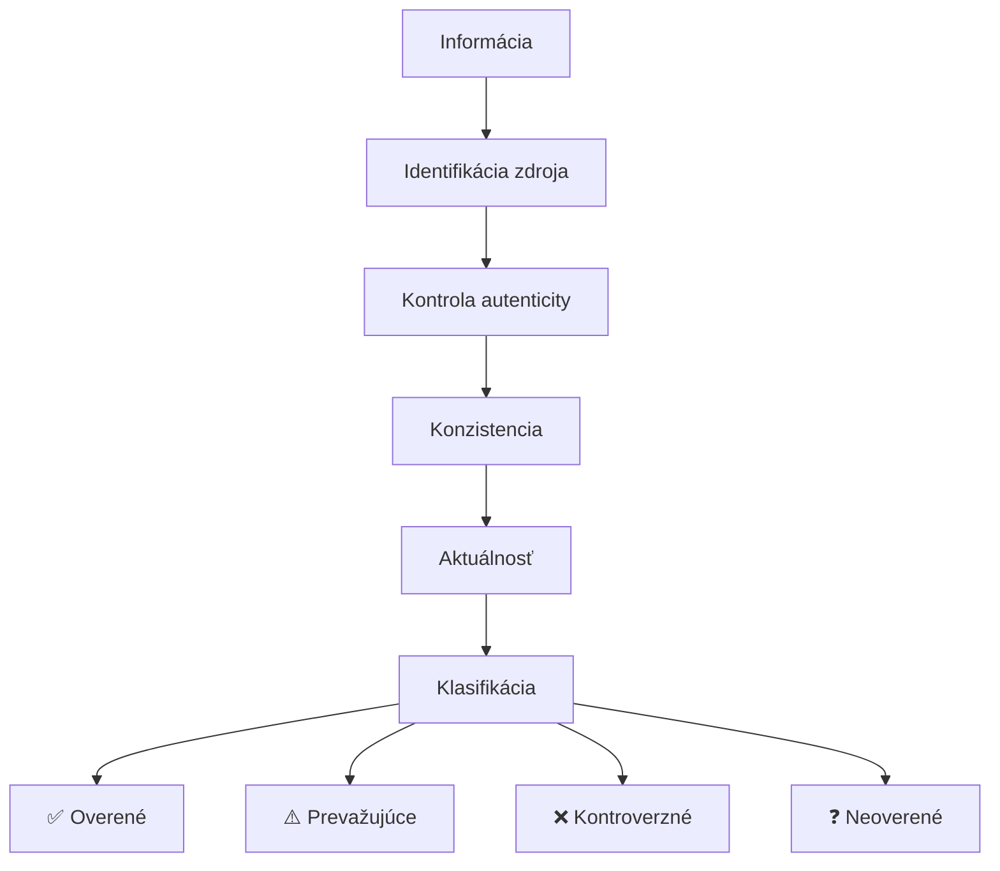
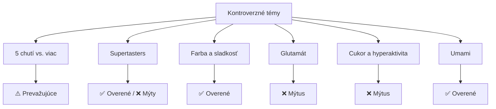

## Úvod

### Prečo overovať zdroje?

Kvalita senzorického výskumu závisí od **kvality zdrojov**. Overenie zdrojov zaisťuje:

- Presnosť informácií
- Vedeckú integritu
- Reprodukovateľnosť výsledkov
- Dôveryhodnosť repozitára

---

## Agenda

1. Metodológia overovania
2. Overené zdroje
3. Kontroverzné témy
4. Aktualizácie a opravy
5. Odporúčania pre ďalší výskum

---

## Metodológia overovania

---

## Kritériá kvality

| Kritérium | Ako overujeme | Prijatelná úroveň |
|-----------|---------------|-------------------|
| **Primárny zdroj** | Peer-reviewed časopis alebo oficiálny štandard | Povinné |
| **Citovateľnosť** | Nájdenie v databáze (Scopus, WoS, ISO) | Povinné |
| **Konzistencia** | Minimálne 3 nezávislé zdroje | Odporúčané |
| **Aktuálnosť** | Publikované za posledných 10 rokov | Odporúčané |
| **Reputácia vydavateľa** | Akademicke vydavateľstvo alebo medzinárodná organizácia | Povinné |

---

## Klasifikácia spoľahlivosti

| Kategória | Označenie | Popis |
|-----------|-----------|-------|
| **Overené** | ✅ | Potvrdené primárnym zdrojom, konzistentné |
| **Prevažujúce** | ⚠️ | Väčšina zdrojov súhlasí, existujú alternatívy |
| **Kontroverzné** | ❌ | Zdroje sa navzájom rozchádzajú |
| **Neoverené** | ❓ | Nedostatok spoľahlivých zdrojov |

---

## Overené ISO štandardy

| ISO číslo | Názov | Rok | Overenie |
|-----------|-------|-----|----------|
| ISO 4120 | Triangle test | 2004 | ✅ |
| ISO 5495 | Paired comparison test | 2005 | ✅ |
| ISO 11035 | Descriptors for sensory profile | 1994 | ✅ |
| ISO 13299 | General guidance for sensory profile | 2016 | ✅ |
| ISO 8586 | Selection, training of assessors | 2012 | ✅ |
| ISO 8589 | Design of test rooms | 2007 | ✅ |
| ISO 11036 | Texture profile | 1994 | ✅ |
| ISO 11037 | Colour assessment | 1999 | ✅ |

---

## Overené knižné zdroje

| Autor(i) | Názov | Vydavateľ | Rok |
|----------|-------|-----------|-----|
| Lawless & Heymann | Sensory Evaluation of Food | Springer | 2010 |
| Stone & Sidel | Sensory Evaluation Practices | Academic Press | 2004 |
| Meilgaard et al. | Sensory Evaluation Techniques | CRC Press | 2007 |
| Kemp et al. | Sensory Evaluation: A Practical Handbook | Wiley-Blackwell | 2011 |
| Piggott (ed.) | Alcoholic Beverages | Woodhead Publishing | 2011 |

---

## Vedecké časopisy

| Časopis | Vydavateľ | Impakt faktor (2024) |
|---------|-----------|----------------------|
| Food Quality and Preference | Elsevier | ~6.0 |
| Journal of Food Science | Wiley | ~3.0 |
| Food Chemistry | Elsevier | ~8.8 |
| Journal of Sensory Studies | Wiley | ~2.5 |
| LWT - Food Science and Technology | Elsevier | ~6.0 |
| Appetite | Elsevier | ~5.0 |
| Chemical Senses | Oxford University Press | ~3.5 |

---

## Kontroverzné témy

---

## "5 chutí" vs. viac chutí

| Téma | Status | Podrobnosti |
|------|--------|-------------|
| Základných chutí je 5 | ⚠️ Prevažujúce | Sladká, slaná, kyslá, horká, umami (od 1908) |
| Kakao ako šiesta chuť | ❌ Kontroverzné | Navrhované, ale nie je široko prijaté |
| Kyslá chuť ako samostatná | ❌ Kontroverzné | Diskusia o samostatnosti |
| Olejová/mastná chuť | ⚠️ Prevažujúce | Existujú receptory na mastné kyseliny |
| Chuť kalcia | ❌ Kontroverzné | Slabé dôkazy |

---

## Supertasters

| Tvrdenie | Status | Podrobnosti |
|----------|--------|-------------|
| Supertasters existujú | ✅ Overené | Bartoshuk et al. (1994) |
| ~25% populácie | ⚠️ Prevažujúce | Pohyb 15–35% podľa štúdie |
| Viac chutových pohárov | ✅ Overené | Anatomický dôkaz |
| Intenzívnejšia horkosť | ✅ Overené | Konzistentné dôkazy |
| Jedia menej zeleniny | ❌ Kontroverzné | Rozdiely medzi štúdiami |
| Lepší senzorickí analytici | ❌ Kontroverzné | Nie je dôkaz |

---

## Červená farba a sladkosť

| Tvrdenie | Status | Podrobnosti |
|----------|--------|-------------|
| Červená zvyšuje sladkosť | ✅ Overené | DuBose et al. (1980), Johnson et al. (1982) |
| Modrá znižuje sladkosť | ✅ Overené | Potvrdzené v štúdiách |
| Zelená ovplyvňuje kyslosť | ⚠️ Prevažujúce | Menej konzistentné dôkazy |
| Biela zvyšuje intenzitu | ⚠️ Prevažujúce | Závisí od kontextu |

**Mechanizmus:** Kognitívna asociácia — červená = zralé ovocie = sladké.

---

## Glutamát a "Chinese restaurant syndrome"

| Tvrdenie | Status | Podrobnosti |
|----------|--------|-------------|
| Spôsobuje "CRS" | ❌ Kontroverzné | Pôvodný článk (1969) metodologicky slabý |
| Bezpečný pre väčšinu | ✅ Overené | FDA, EFSA, JECFA |
| Citliví jednotlivci | ⚠️ Prevažujúce | Limitované dôkazy |
| Prirodne vyskytuje | ✅ Overené | Rajčaty, syry, huby, mäso |

---

## Cukor a hyperaktivita

| Tvrdenie | Status | Podrobnosti |
|----------|--------|-------------|
| Spôsobuje hyperaktivitu | ❌ Kontroverzné | Metaanalýzy nepotvrdzú kauzalitu |
| Zvyšuje energiu | ✅ Overené | Fyziologický efekt |
| Rodičia vnímajú efekt | ⚠️ Prevažujúce | Placebo/nocebo efekt |
| Spôsobuje ADHD | ❌ Kontroverzné | Nie je vedecký dôkaz |

**Kľúčové štúdie:** Wolraich et al. (1995), Benton (2008), Farsad-Naeimi et al. (2020)

---

## Umami

| Tvrdenie | Status | Podrobnosti |
|----------|--------|-------------|
| Samostatná chuť | ✅ Overené | Receptory T1R1/T1R3 |
| Objavené 1908 | ✅ Overené | Ikeda K., Tokio |
| Receptor identifikovaný 2000 | ✅ Overené | Li et al., Nature |
| Univerzálne uznávané | ⚠️ Prevažujúce | Kultúrne rozdiely |
| Zvyšuje chuťový zážitok | ✅ Overené | Synergia s ostatnými chutami |

---

## Aktualizácie (2020–2026)

| Oblasť | Zmena | Zdroj |
|--------|-------|-------|
| ISO 13299 | Aktualizované v 2016 | ISO |
| Temporálna senzorika | Rastúci zájem o TDS | Castura et al. |
| AI v senzorike | Strojové učenie na predikciu | Viacero časopisov |
| Consumer neuroscience | Integrácia EEG, eye-trackingu | Viacero časopisov |
| Personalizácia | Individuálne rozdiely | Viacero časopisov |

---

## Odporúčania pre výskum

### Kde hľadať spoľahlivé informácie

| Zdroj | Typ | Odporúčanie |
|-------|-----|-------------|
| ISO štandardy | Normy | Primárny zdroj pre metodológiu |
| PubMed | Databáza | Pre vedecké dôkazy |
| Scopus | Databáza | Pre citácie a impakt |
| Web of Science | Databáza | Pre citácie a impakt |
| Google Scholar | Vyhľadávač | Pre široký prehľad |
| IFST | Organizácia | Pre aktuálne trendy |

---

## Ako vyhodnocovať zdroje

1. **Skontrolujte vydavateľa** — akademicke vydavateľstvo
2. **Overte si rok** — preferujte články za posledných 5 rokov
3. **Pozrite si citácie** — vysoký počet = väčšia dôveryhodnosť
4. **Skontrolujte metodológiu** — randomizované kontrolované štúdie
5. **Buďte opatrní s prezentáciami** — konferenčné príspevky často neprešli peer review

---

## Témy pre budúci výskum

| Téma | Prečo je dôležité | Aktuálna medzera |
|------|-------------------|------------------|
| Genetika chutových receptorov | Personalizácia senzoriky | Mapovanie polymorfizmov |
| Mikrobióm a chuť | Vplyv na individuálne rozdiely | Kauzálne vzťahy |
| AI predikcia | Efektivita výskumu | Validácia modelov |
| Kultúrne rozdiely | Globalizácia potravín | Systémové štúdie |
| Udržateľnosť | Alternatívne potraviny | Akceptácia spotrebiteľov |

---

## Záver

Overenie zdrojov je **nepretržitý proces**, ktorý zaisťuje kvalitu a dôveryhodnosť repozitára SAP.

### Princípy

- ✅ Každá informácia prešla procesom overovania
- ⚠️ Kontroverzné témy sú jasne označené
- ❌ Mýty sú identifikované a vysvetlené
- ❓ Neoverené informácie sú označené pre ďalší výskum

---

## Ďakujem za pozornosť

**Otázky?**

*SAP — Senzorická Analýza Potravín*
