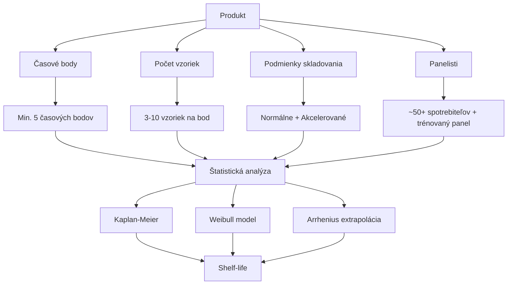

## Úvod

### Čo je sensory shelf-life?

Sensory shelf-life je **časový interval**, počas ktorého potravinársky produkt udržuje svoje senzorické vlastnosti na úrovni akceptovateľnej pre spotrebiteľa za daných podmienok skladovania.

::: notes
Sensory shelf-life predstavuje senzorickú trvanlivosť produktu. Podľa Hougha (2010) závisí aj od spotrebiteľa: kľúčová otázka je, aká časť spotrebiteľov produkt skladovaný čas t odmietne. Norma: ISO 16779:2015.
:::

---

## Prečo je shelf-life dôležité?

| Aspekt | Význam |
|--------|--------|
| **Kvalita produktu** | Zaisťuje udržanie charakteristiky počas celej trvanlivosti |
| **Spokojnosť spotrebiteľa** | Minimalizuje reklamácie a návraty |
| **Konkurencieschopnosť** | Dlhšia shelf-life = väčšia flexibilita v distribúcii |
| **Straty** | Predlženie shelf-life = zníženie vyradených produktov |
| **Bezpečnosť** | Senzorická degradácia môže indikovať mikrobiologické problémy |

---

## Agenda

1. Kaplan-Meierov odhad
2. Weibullova distribúcia
3. ASLT a Q10 model
4. Arrheniusov model
5. Survival analysis
6. Cut-off point metóda
7. Dizajn shelf-life štúdie
8. Praktické príklady

---

## Typy produktov a degradácia

| Kategória | Typická degradácia | Typická shelf-life |
|-----------|--------------------|--------------------|
| **Mliečne výrobky** | Kyslosť, oxidácia, textúra | 14–30 dní |
| **Chlieb a pečivo** | Stárnutie (staling), plesnivý | 3–7 dní |
| **Nápoje** | Oxidácia, strata účinnosti | 6–12 mesiacov |
| **Mäso** | Oxidácia tuku, mikrobiologický rast | 7–14 dní |
| **Ovocie a zelenina** | Vädnutie, hniloba, strata chuti | 3–14 dní |
| **Konzervy** | Korózia, strata textúry | 12–36 mesiacov |

---

## Kaplan-Meierov odhad

**Princíp:** Neparametrický odhad S(t) = pravdepodobnosti, že spotrebiteľ produkt skladovaný čas t akceptuje (udalosť = odmietnutie). Dáta sú v praxi intervalovo cenzurované → Hough odporúča parametrický model. [SaIT cvičenie 10](https://senzorika.github.io/SaIT/teoria/cvicenie10.html)

$$S(t) = \prod_{t_i \leq t} \left(1 - \frac{d_i}{n_i}\right)$$

| Čas (dni) | V riziku (nᵢ) | Prvé odmietnutia (dᵢ) | S(t) |
|------------|----------------|-----------------|------|
| 0 | 50 | 0 | 1.00 |
| 7 | 50 | 2 | 0.96 |
| 14 | 48 | 5 | 0.86 |
| 21 | 43 | 8 | 0.70 |
| 28 | 35 | 10 | 0.50 |
| 35 | 25 | 12 | 0.26 |
| 42 | 13 | 8 | 0.10 |

**Mediánová shelf-life:** 28 dní (S(t) = 0.50 → 50 % spotrebiteľov odmieta)

---

## Weibullova distribúcia

**Princíp:** Flexibilná parametrická distribúcia modelujúca degradáciu produktu v čase.

$$F(t) = 1 - \exp\left(-\left(\frac{t}{\eta}\right)^\beta\right)$$

| Parameter | Význam |
|-----------|--------|
| **η (eta)** | Charakteristická životnosť (scale) |
| **β (beta)** | Tvarový parameter (shape) |

### Interpretácia β

| β | Hazard odmietnutí | Význam |
|---|----------------|---------|
| **β < 1** | Klesajúci | Časť spotrebiteľov odmieta hneď od začiatku |
| **β = 1** | Konštantný | Odmietnutia rovnomerne v čase |
| **β > 1** | Rastúci | Typické – odmietnutí pribúda so starnutím |

---

## ASLT — Accelerated Shelf-Life Testing

**Princíp:** Urýchlenie degradácie zvýšením teploty a extrapolácia na normálne podmienky.

### Q10 Model

$$Q_{10} = \frac{\text{Shelf-life pri } T_1}{\text{Shelf-life pri } T_2}$$

Kde $T_2 = T_1 + 10°C$

### Vzťah

$$\text{Shelf-life}(T_2) = \frac{\text{Shelf-life}(T_1)}{Q_{10}^{(T_2-T_1)/10}}$$

⚠️ Starnutie chleba (retrogradácia) nie je arrheniovské – v chladničke je rýchlejšie.

---

## Arrheniusov model

$$k = A \cdot \exp\left(-\frac{E_a}{R \cdot T}\right)$$

| Symbol | Význam | Jednotka |
|--------|--------|----------|
| **k** | Rýchlostná konštanta degradácie | deň⁻¹ |
| **A** | Preexponenciálny faktor | deň⁻¹ |
| **Ea** | Energia aktivácie | J/mol |
| **R** | Univerzálna plynová konštanta (8.314) | J/(mol·K) |
| **T** | Absolútna teplota | K |

### Vzťah medzi Q10 a Ea

$$\ln Q_{10} = \frac{10\,E_a}{R\,T\,(T+10)} \approx \frac{10\,E_a}{R\,T^2}$$

---

## Survival Analysis

**Princíp:** Štatistická metóda na analýzu časových dát, kde "udalosť" je zamietnutie produktu.

### Prežívacia funkcia

$$S(t) = P(T > t) = 1 - F(t)$$

### Hazard funkcia

$$h(t) = \frac{f(t)}{S(t)} = -\frac{d}{dt}[\ln S(t)]$$

### Cox Proportional Hazards Model

$$h(t|X) = h_0(t) \times \exp(\beta_1 X_1 + \beta_2 X_2 + ... + \beta_p X_p)$$

---

## Cut-off Point Metóda

**Princíp:** Definuje konkrétny bod, pri ktorom produkt prestáva byť akceptovateľný.

| Typ | Definícia | Použitie |
|-----|-----------|---------|
| **Senzorický cut-off** | Hodnota atribútu, pri ktorej produkt prestáva byť akceptovateľný | Deskriptívna analýza |
| **Spotrebiteľský cut-off** | Prípustný % odmietnutí (napr. 25 % alebo 50 %) – rozhodnutie výrobcu | Spotrebiteľský test |
| **Kombinovaný cut-off** | Kombinácia oboch prístupov | Komplexné hodnotenie |

---

## Dizajn štúdie



---

## Časové body

| Typ produktu | Časové body (dni) | Počet bodov |
|--------------|-------------------|-------------|
| **Krátkodobá** (< 30 dní) | 0, 3, 7, 10, 14, 21, 28 | 5–7 |
| **Stredná** (30–180 dní) | 0, 14, 30, 60, 90, 120, 180 | 5–7 |
| **Dlhá** (> 180 dní) | 0, 30, 60, 90, 120, 180, 240, 360 | 6–8 |

### Pravidlá

1. **Hustejšie body okolo očakávaného konca trvanlivosti** – tam je informácia pre odhad najcennejšia
2. **Aj body za očakávaným koncom** – krivka má dosiahnuť ~50 % odmietnutí
3. **Minimálne 5–6 časových bodov**
4. **Reverzný dizajn** – vzorky rôzneho veku hodnotené v jeden deň

---

## Podmienky skladovania

| Parameter | Typické podmienky | Akcelerované podmienky |
|-----------|-------------------|----------------------|
| **Teplota** | 4°C, 20°C, 25°C | 30°C, 35°C, 40°C |
| **Vlhkosť** | 50% RH, 60% RH | 75% RH, 85% RH |
| **Svetlo** | Tmavé, normálne | UV, intenzívne |
| **Atmosféra** | Vzduch, vákum | N₂, CO₂, modifikovaná |

---

## Q10 Koeficient

| Kategória produktu | Typické Q10 | Poznámka |
|--------------------|-------------|----------|
| **Mliečne výrobky** | 2–4 | Závisí od obsahu tuku |
| **Chlieb a pečivo** | — | Retrogradácia nie je arrheniovská |
| **Nápoje** | 2–3 | Oxidácia |
| **Mäso** | 2–4 | Oxidácia tuku |
| **Ovocie a zelenina** | 2–3 | Enzymatická degradácia |
| **Konzervy** | 1.5–2.5 | Korózia, textúra |

---

## Energia aktivácie (Ea)

$$E_a = -R \times \frac{\ln(k_2/k_1)}{1/T_2 - 1/T_1}$$

| Typ reakcie | Ea (kJ/mol) |
|-------------|-------------|
| **Oxidácia lipidov** | 40–100 |
| **Enzymatické reakcie** | 40–130 |
| **Rast mikroorganizmov** | 80–120 |
| **Maillardovo hnednutie** | 100–200 |
| **Degradácia vitamínov** | 40–130 |
| **Starnutie chleba** | nie je arrheniovské |

---

## Výpočet shelf-life

```mermaid
flowchart LR
    A[Zber dát] --> B[Prežívacia funkcia]
    B --> C[Weibull fit]
    C --> D[t₅₀ = η × ln2^(1/β)]
    C --> E[t₂₅ = η × 0.288^(1/β)]
    D --> F[Bezpečnostný faktor]
    E --> F
    F --> G[Best before dátum]
```

### Weibullove parametre

$$t_{50} = \eta \times (\ln 2)^{1/\beta}$$

$$t_{25} = \eta \times (-\ln 0.75)^{1/\beta} = \eta \times 0.288^{1/\beta}$$

---

## Praktický príklad: Jogurt

**Produkt:** Jogurt s jahodami, skladovaný pri 4°C

| Čas (dni) | Chuť | Vôňa | Textúra | Akceptujúci spotrebitelia (%) |
|------------|------|------|---------|-------------------|
| 0 | 8.5 | 8.2 | 8.0 | 100 |
| 7 | 8.0 | 7.8 | 7.5 | 95 |
| 14 | 7.2 | 7.0 | 6.8 | 85 |
| 21 | 6.5 | 6.2 | 6.0 | 70 |
| 28 | 5.8 | 5.5 | 5.2 | 55 |
| 35 | 5.0 | 4.8 | 4.5 | 35 |
| 42 | 4.2 | 4.0 | 3.8 | 15 |

**Weibull fit:** β = 2.29, η = 33.6 dní → t₅₀ = 28.6 d, t₂₅ = 19.5 d

**Záver:** Mediánová trvanlivosť ≈ 29 dní; pri 25 % odmietnutí ≈ 19–20 dní

---

## Praktický príklad: Chlieb

**Produkt:** Chlieb, skladovaný pri 20°C

| Čas (dni) | Staling | Chuť | Textúra | Akceptabilita (%) |
|------------|---------|------|---------|-------------------|
| 0 | 1.0 | 8.5 | 8.0 | 100 |
| 1 | 2.5 | 7.8 | 7.2 | 90 |
| 2 | 4.0 | 7.0 | 6.5 | 75 |
| 3 | 5.5 | 6.2 | 5.8 | 55 |
| 5 | 7.0 | 5.0 | 4.5 | 30 |
| 7 | 8.0 | 4.0 | 3.5 | 10 |
| 10 | 9.0 | 3.0 | 2.5 | 0 |

**Weibull fit:** β = 1.60, η = 4.27 dní → t₅₀ = 3.4 d, t₂₅ = 2.0 d

**Záver:** Mediánová trvanlivosť ≈ 3 dni; pri 25 % odmietnutí ≈ 2 dni

---

## Best Before Dátum

„Spotrebujte do" určuje mikrobiologická bezpečnosť; senzorika je podkladom pre „spotrebujte najlepšie do" (1169/2011, čl. 24). Priamo: zvoliť prípustný podiel odmietnutí (napr. 25 %) → t₂₅. Alternatívna firemná prax (nie norma):

1. Vypočítajte mediánovú shelf-life (t₅₀)
2. Aplikujte bezpečnostný faktor (0.7–0.9)
3. Zaokrúhlite nadol na celé dni

| Typ produktu | Odporúčaný faktor | Dôvod |
|--------------|-------------------|-------|
| **Citlivé potraviny** | 0.7 | Vyššie riziko reklamácií |
| **Bežné potraviny** | 0.8 | Štandardná ochrana |
| **Konzervy** | 0.9 | Nízke riziko |
| **Mrazené výrobky** | 0.75 | Závisí od chladiaceho reťazca |

---

## Záver

Sensory shelf-life testing je **komplexný proces**, ktorý kombinuje:

- Senzorickú analýzu
- Štatistické modelovanie
- Techniky urýchleného starnutia

### Kľúčové princípy

1. **Správny dizajn** – dostatočný počet časových bodov, vzoriek a panelistov
2. **Vhodná štatistická analýza** – Kaplan-Meier, Weibull, Arrhenius
3. **Bezpečnostný faktor** – konzervatívny prístup k "best before"
4. **Kompletná dokumentácia** – všetky dáta zdokumentované

---

## Ďakujem za pozornosť

**Otázky?**

*SAP — Senzorická Analýza Potravín*

## Precvič v R – SaIT {.smaller}

Praktické cvičenia k tejto téme v repozitári [SaIT – Senzometria v R](https://github.com/senzorika/SaIT):

| Téma | Cvičenie SaIT |
|---|---|
| Kaplan-Meierov odhad, cut-off bod | [10 – Analýza prežitia a senzorická trvanlivosť](https://senzorika.github.io/SaIT/teoria/cvicenie10.html) |
| Regresia senzorických dát v čase | [6 – Korelácia a lineárna regresia](https://senzorika.github.io/SaIT/teoria/cvicenie06.html) |
| Prípadová štúdia senzorickej trvanlivosti | [20 – Kontrolné prípadové štúdie II](https://senzorika.github.io/SaIT/teoria/cvicenie20.html) |

Prednášky: [Spotrebiteľský výskum](https://senzorika.github.io/SaIT/prezentacie/sk/06_spotrebitelsky_vyskum.html)

::: {.callout-note}
Obsah bol v 09/2026 overený a opravený — pozri [Overenie zdrojov](../overenie/overenie_zdrojov.md).
:::
