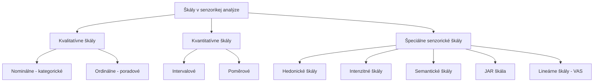
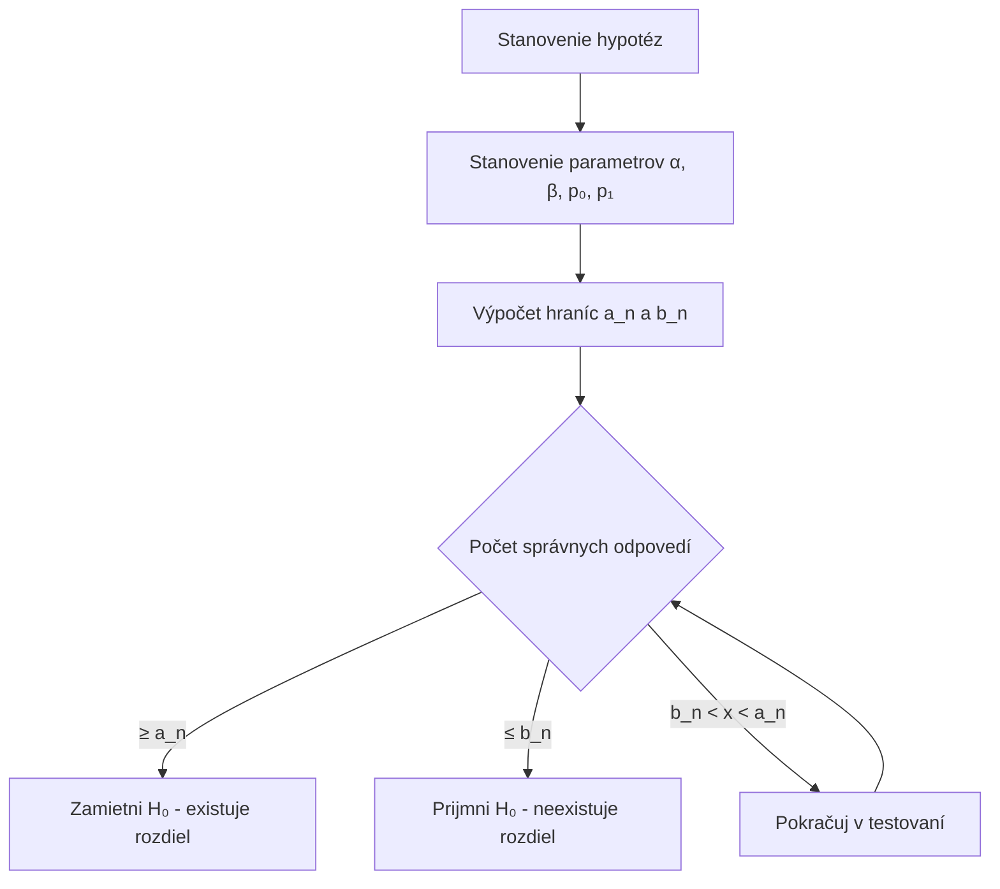
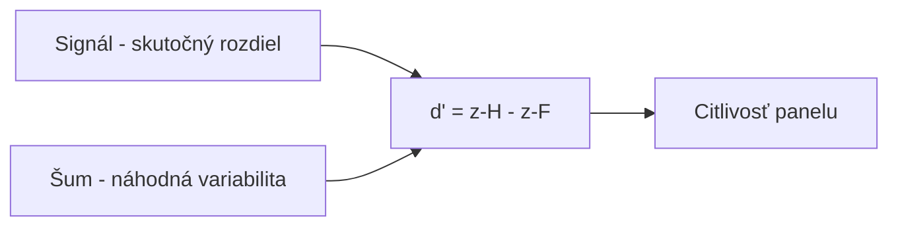
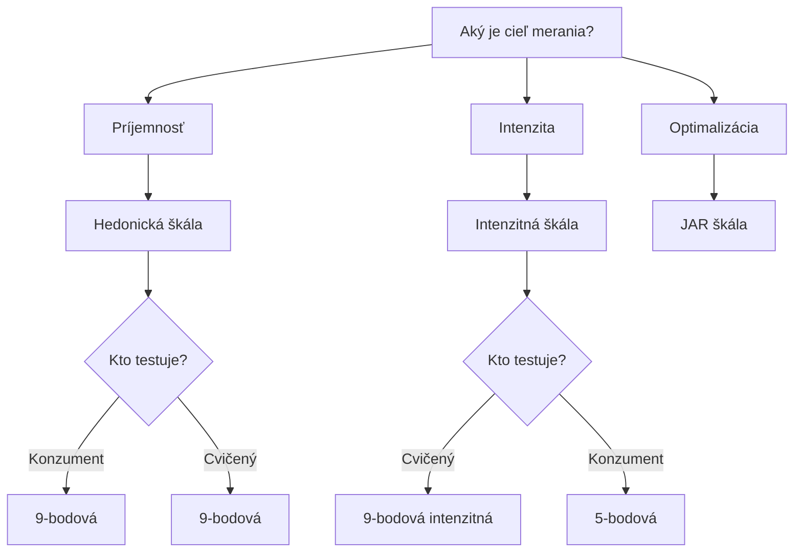

## Úvod

::: {style="text-align: center;"}
### Čo je škálovanie?

Proces **priradení číselných hodnôt** senzorickým vlastnostiam alebo subjektívnym pocitom.

Umožňuje kvantifikovať kvalitatívne vlastnosti produktov do **kvantitatívnych dát** vhodných na štatistickú analýzu.
:::

## Prečo je škálovanie dôležité?

| Dôvod | Vysvetlenie |
|---|---|
| **Kvantifikácia** | Prevod subjektívnych pocitov na číselné hodnoty |
| **Štatistická analýza** | Umožňuje výpočet priemerov, smerodajných odchýlok, testov |
| **Porovnateľnosť** | Umožňuje porovnávať produkty, panely, časové body |
| **Komunikácia** | Objektívny spôsob prenosu senzorických výsledkov |
| **Vývoj produktu** | Sledovanie zmien v čase, optimalizácia receptúr |
| **Kontrola kvality** | Stanovenie akceptačných limitov |

## Typy škál



## 9-bodová hedonická škála

*(Peryam & Pilgrim, 1957)*

| Bod | Označenie | Popis |
|---|---|---|
| 9 | Extrémne mi sa páči | Najvyššia možná príjemnosť |
| 8 | Veľmi mi sa páči | Vysoká príjemnosť |
| 7 | Mierne mi sa páči | Stredne vysoká príjemnosť |
| 6 | Trochu mi sa páči | Mierna príjemnosť |
| 5 | Ani mi sa páči, ani nepáči | Neutrálna hodnota |
| 4 | Trochu sa mi nepáči | Mierna nepríjemnosť |
| 3 | Mierne sa mi nepáči | Stredne vysoká nepríjemnosť |
| 2 | Veľmi sa mi nepáči | Vysoká nepríjemnosť |
| 1 | Extremne sa mi nepáči | Najnižšia možná príjemnosť |

## 7-bodová a 5-bodová hedonická škála

### 7-bodová škála

| Bod | Označenie |
|---|---|
| 7 | Veľmi mi sa páči |
| 6 | Mi sa páči |
| 5 | Trochu mi sa páči |
| 4 | Neutrálne |
| 3 | Trochu sa mi nepáči |
| 2 | Nepáči sa mi |
| 1 | Veľmi sa mi nepáči |

### 5-bodová škála

| Bod | Označenie |
|---|---|
| 5 | Veľmi dobré |
| 4 | Dobré |
| 3 | Priemerné |
| 2 | Zlé |
| 1 | Veľmi zlé |

## Výpočet prijatia a odmietnutia

### Priemerné skóre

$$\bar{x} = \frac{\sum_{i=1}^{n} x_i}{n}$$

### Percento prijatia

$$\% \text{ Prijatia} = \frac{\text{Počet testovateľov so skóre} \geq 6}{n} \times 100$$

### Percento odmietnutia

$$\% \text{ Odmietnutia} = \frac{\text{Počet testovateľov so skóre} \leq 4}{n} \times 100$$

### Index prijatia

$$AI = \frac{\bar{x} - 1}{8} \times 100$$

## Kedy použiť ktorú hedonickú škálu

| Škála | Odporúčané použitie |
|---|---|
| **9-bodová** | Výskum produktu, konzumentské testy, porovnanie produktov |
| **7-bodová** | Rýchle testy, konzumentské testy, deti |
| **5-bodová** | Screeningové testy, deti, rýchle kontroly |

## Intenzitné škály

### Kategorické škály (3, 5, 7, 9-bodové)

Používajú sa na meranie **intenzity** konkrétneho senzorického atribútu.

**Príklad – 9-bodová intenzitná škála pre sladkosť:**

| Bod | Označenie |
|---|---|
| 9 | Extrémne sladké |
| 8 | Veľmi sladké |
| 7 | Výrazne sladké |
| 6 | Stredne sladké |
| 5 | Mierne sladké |
| 4 | Trochu sladké |
| 3 | Slabo sladké |
| 2 | Veľmi slabo sladké |
| 1 | Nesladké |

## Lineárna škála (VAS)

**Nepretržitá škála** dlhá 15 cm, kde testovate� označí intenzitu atribútu čiarou.

```
0 cm                                          15 cm
|─────────────────────────────────────────────|
Najslabšie                              Najsilnejšie
vnímané                                  vnímané
```

$$Hodnota = \frac{\text{Vzdialenosť od ľavého okraja (cm)}}{15} \times 100$$

## Semantická diferenciálna škála

*(Osgood, 1957)*

Používa **bipolárne adjektíva** na meranie **perceptuálnych** a **afektívnych** reakcií.

```
Nepríjemné  ←──┼──┼──┼──┼──┼──→  Príjemné
              1  2  3  4  5  6  7

Slabé       ←──┼──┼──┼──┼──┼──→  Silné
              1  2  3  4  5  6  7

Prírodné    ←──┼──┼──┼──┼──┼──→  Umelé
              1  2  3  4  5  6  7
```

## Výpočet priemerov a CI

### Priemerné skóre

$$\bar{x} = \frac{\sum_{i=1}^{n} x_i}{n}$$

### Smerodajná odchýlka

$$s = \sqrt{\frac{\sum_{i=1}^{n} (x_i - \bar{x})^2}{n-1}}$$

### 95% Interval spoľahlivosti

$$CI = \bar{x} \pm t_{0.025, n-1} \times \frac{s}{\sqrt{n}}$$

## Waldova sekvenčná analýza

### Princíp

**Adaptívny prístup** k testovaniu — rozhodnutie sa prijíma **postupne** po každej odpovedi testovateľa.



### Výpočet hraníc

$$a_n = \frac{\ln\left(\frac{1-\beta}{\alpha}\right) + n \cdot \ln\left(\frac{1-p_0}{1-p_1}\right)}{\ln\left(\frac{p_1}{p_0}\right) - \ln\left(\frac{1-p_0}{1-p_1}\right)}$$

$$b_n = \frac{\ln\left(\frac{\beta}{1-\alpha}\right) + n \cdot \ln\left(\frac{1-p_0}{1-p_1}\right)}{\ln\left(\frac{p_1}{p_0}\right) - \ln\left(\frac{1-p_0}{1-p_1}\right)}$$

## Thurstone d-prime (d')

### Princíp

Miera **citlivosti** odvodená z **teórie detekcie signálu** (Signal Detection Theory).



### Výpočet

$$d' = z(\text{Hit Rate}) - z(\text{False Alarm Rate})$$

Kde:
- **Hit Rate (H):** Pravdepodobnosť správnej identifikácie odlišnej vzorky
- **False Alarm Rate (F):** Pravdepodobnosť chybnej identifikácie

## Interpretácia d'

| d' hodnota | Interpretácia | Úroveň citlivosti |
|---|---|---|
| 0.0 | Žiadna citlivosť | Náhodné hádanie |
| 0.5 | Veľmi slabá | Takmer neznáma |
| 1.0 | Slabá | Rozoznateľná |
| 1.5 | Umiernená | Jasná |
| 2.0 | Dobrá | Veľmi jasná |
| 2.5 | Výborná | Takmer dokonalá |
| 3.0+ | Výborná | Takmer dokonalá |

## JAR škála (Just-About-Right)

### Princíp

Testovateľ hodnotí, či je intenzita atribútu **príliš nízka**, **práve správna** alebo **príliš vysoká**.

```
1        2        3        4        5
│────────│────────│────────│────────│
Príliš   Trochu   Práve    Trochu   Príliš
slabé    slabé    správne  silné    silné
```

### Penalty analysis

$$\text{Penalty} = \bar{x}_{JAR} - \bar{x}_{non-JAR}$$

| Penalty | Význam |
|---|---|
| < 0.5 | Zanedbateľný |
| 0.5 – 1.0 | Malý |
| 1.0 – 1.5 | Stredný |
| > 1.5 | Významný |

## Porovnanie škál

| Škála | Typ | Citlivosť | Jednoduchosť | Konzumenti | Cvičený panel |
|---|---|---|---|---|---|
| **9-bodová hedonická** | Kategorická | Stredná | Vysoká | Vysoká | Vysoká |
| **7-bodová hedonická** | Kategorická | Stredná | Vysoká | Vysoká | Vysoká |
| **5-bodová hedonická** | Kategorická | Nízka | Vysoká | Vysoká | Stredná |
| **9-bodová intenzitná** | Kategorická | Vysoká | Stredná | Nízka | Vysoká |
| **Lineárna (VAS)** | Kontinuálna | Vysoká | Stredná | Nízka | Vysoká |
| **Semantická** | Kategorická | Stredná | Stredná | Stredná | Vysoká |
| **JAR** | Kategorická | Vysoká | Vysoká | Vysoká | Vysoká |

## Výber správnej škály



## Praktický príklad 1: 9-bodová hedonická škála

**Scénár:** Test príjemnosti nového jogurta s nízkym obsahom cukru. 50 konzumentov.

| Skóre | Počet testovateľov |
|---|---|
| 9 | 5 |
| 8 | 12 |
| 7 | 15 |
| 6 | 10 |
| 5 | 5 |
| 4 | 2 |
| 3 | 1 |
| 2 | 0 |
| 1 | 0 |

**Výpočet:**

$$\bar{x} = \frac{9 \times 5 + 8 \times 12 + 7 \times 15 + 6 \times 10 + 5 \times 5 + 4 \times 2 + 3 \times 1}{50} = \frac{342}{50} = 6.84$$

$$\% \text{ Prijatia} = \frac{5 + 12 + 15 + 10}{50} \times 100 = 84\%$$

$$AI = \frac{6.84 - 1}{8} \times 100 = 73\%$$

**Záver:** Jogurt má **vysokú príjemnosť** (84% prijatia, index 73%).

## Praktický príklad 2: Thurstone d'

**Scénár:** Test citlivosti panelu – rozlíšenie dvoch vzoriek syra. 20 testovateľov × 10 pokusov.

**Výsledky:**
- Pri odlišných vzorkách: 80 správnych z 100 pokusov
- Pri rovnakých vzorkách: 20 chybných z 100 pokusov

$$H = \frac{80}{100} = 0.80, \quad F = \frac{20}{100} = 0.20$$

$$z(H) = z(0.80) \approx 0.842, \quad z(F) = z(0.20) \approx -0.842$$

$$d' = 0.842 - (-0.842) = 1.684$$

**Záver:** d' = 1.684 → **Umiernená citlivosť**. Odporúča sa ďalší tréning.

## Praktický príklad 3: JAR škála

**Scénár:** Optimalizácia sladkosti limonády. 80 konzumentov.

| Kategória | Počet | Priemerné skóre príjemnosti |
|---|---|---|
| Príliš sladká (1) | 10 | 4.5 |
| Trochu sladká (2) | 20 | 6.2 |
| JAR (3) | 35 | 7.9 |
| Trochu sladká (4) | 12 | 6.5 |
| Príliš sladká (5) | 3 | 4.8 |

**Penalty za „príliš sladké":**

$$\text{Penalty} = 7.9 - \frac{10 \times 4.5 + 20 \times 6.2}{30} = 7.9 - 5.63 = 2.27$$

**Záver:** Obe kategórie majú **významný penalty** (> 1.5). Odporúča sa zníženie cukru o 15%.

## Záver

Škálovanie je **základný pilier** senzorikej analýze.

Výber správnej škály závisí od:

- **Cieľa merania** (príjemnosť vs. intenzita vs. optimalizácia)
- **Typu panelu** (cvičený vs. konzument)
- **Počtu atribútov** (jeden vs. viacero)
- **Dostupných zdrojov** (čas, testovatelia)

> Moderná senzorická analýza často používa **mix prístupov** – hedonické škály pre celkovú príjemnosť, intenzitné škály pre jednotlivé atribúty a JAR škály pre optimalizáciu.

## Referencie

- Lawless, H.T. & Heymann, H. (2010). *Sensory Evaluation of Food: Principles and Practices*. Springer.
- Stone, H. & Sidel, J.L. (2004). *Sensory Evaluation Practices*. Elsevier.
- Osgood, C.E. et al. (1957). *The Measurement of Meaning*. University of Illinois Press.
