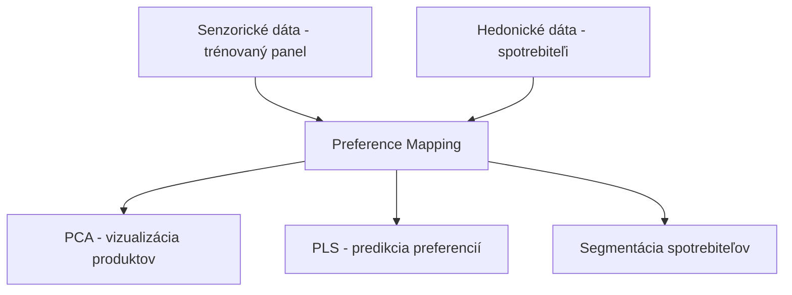
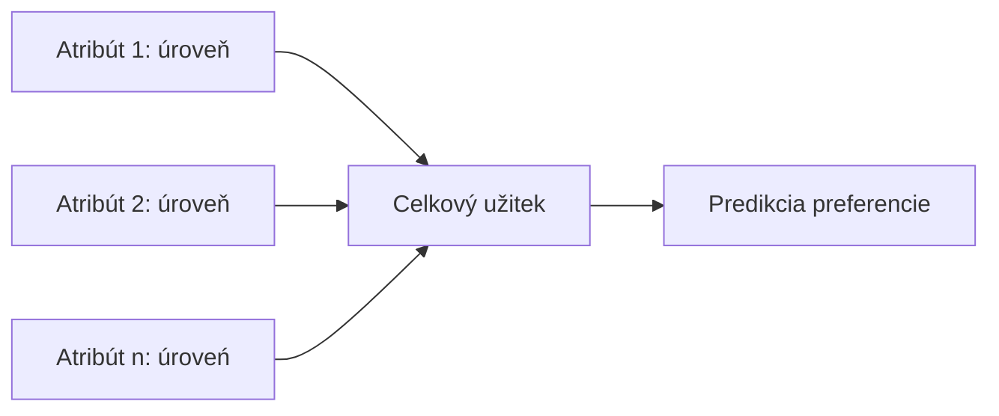
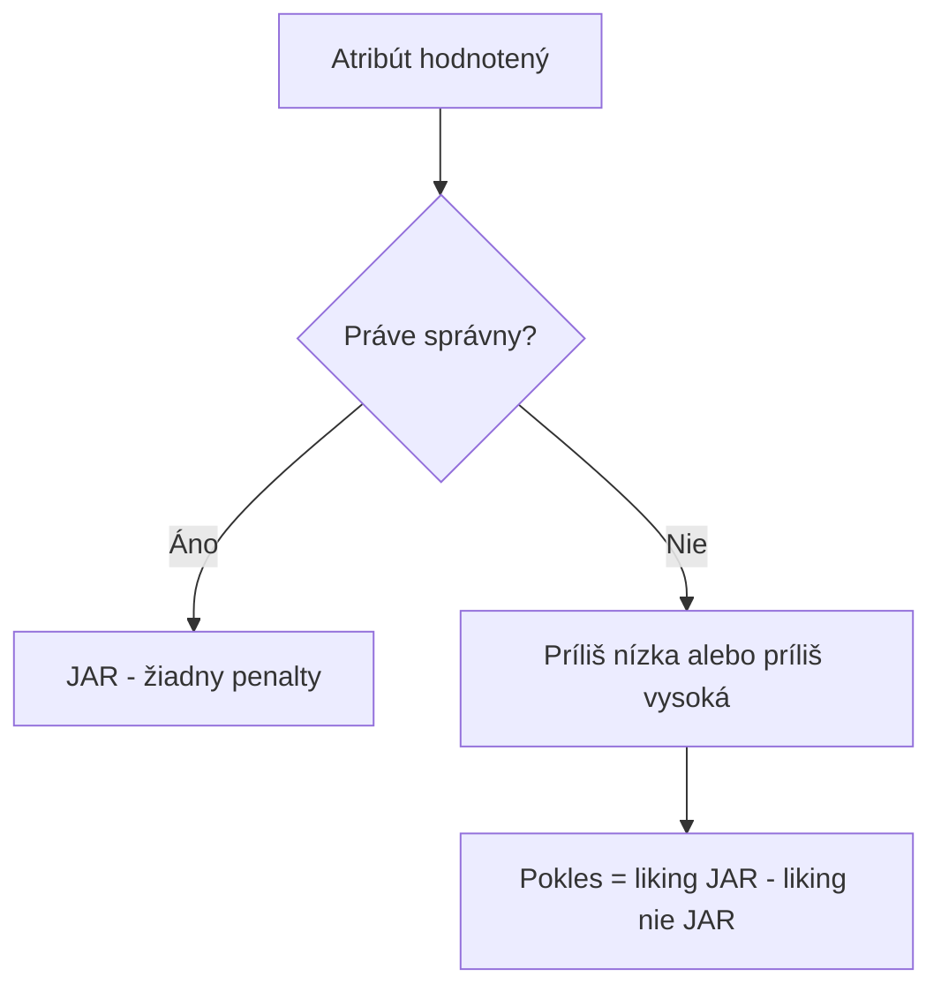
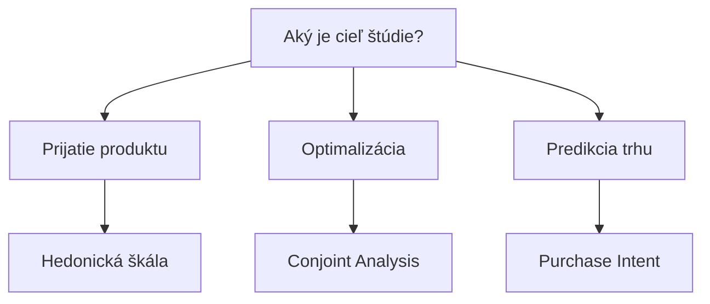

## Úvod

::: {style="text-align: center;"}
### Čo je spotrebiteľská senzorická veda?

Disciplína, ktorá skúma vzťah medzi **senzorickými vlastnosťami produktov** a **reakciami spotrebiteľov**. Zameriava sa na pochopenie toho, ako spotrebiteľi vnímajú, hodnotia a vyberajú produkty na základe ich senzorických vlastností.
:::

## História

| Obdobie | Vývoj |
|---------|-------|
| 1940s | Prvé hedonické testy v armáde (US Army Quartermaster) |
| 1950s | Vývoj 9-bodovej hedonické škály (Peryam & Pilgrim) |
| 1971–1972 | Conjoint (Green & Rao) · PREFMAP (Carroll) |
| 1990s | Preferenčné mapovanie v senzorike (Greenhoff & MacFie) |
| 2000s | Penalty analýza JAR (ASTM MNL 63) |
| 1990s | TURF Analysis, segmentácia spotrebiteľov |
| 2000s | Online testy, automatizácia |
| 2010s | Big data, integrácia s neurovedou |

## Význam

- **Redukcia rizika** – znižuje pravdepodobnosť neúspechu produktu na trhu
- **Optimalizácia** – pomáha nájsť optimálnu receptúru
- **Segmentácia** – identifikuje cieľové skupiny spotrebiteľov
- **Inovácia** – poskytuje informácie pre vývoj nových produktov
- **Konkurencieschopnosť** – pomáha sa odlišovať od konkurencie

## Hedonické testy

### 9-bodová hedonická škála

| Bod | Označenie | Popis |
|-----|-----------|-------|
| 9 | Mimoriadne sa mi páči | Najvyššia miera obľúbenosti |
| 8 | Veľmi sa mi páči | |
| 7 | Stredne sa mi páči | |
| 6 | Trochu sa mi páči | |
| 5 | Ani sa mi páči, ani sa mi nepáči | Neutrálna hodnota |
| 4 | Trochu sa mi nepáči | |
| 3 | Stredne sa mi nepáči | |
| 2 | Veľmi sa mi nepáči | |
| 1 | Mimoriadne sa mi nepáči | Najnižšia miera obľúbenosti |

### Počet spotrebiteľov

| Typ testu | Odporúčaný počet | Poznámka |
|-----------|------------------|----------|
| Exploratórny | 50–80 | Rýchly screening |
| Standardný | 100–150 | Väčšina štúdií |
| Robustný | 200+ | Kľúčové rozhodnutia |
| Online | 300+ | Väčšie súbory dát |

## Podmienky testovania

- **Laboratórium:** kontrolované svetlo, teplota, vlhkosť
- **Izolované kabíny:** minimalizácia rušivých vplyvov
- **Náhodné poradie:** eliminácia efektu poradia
- **Anonymita:** spotrebiteľi nepoznajú značku
- **Čas:** obvykle ráno alebo poobede
- **Obmedzenia:** nefajčiť, nejesť, nepiť kávu aspoň 1 hodinu pred testom

## Preference Mapping

### Princíp

Technika, ktorá kombinuje **senzorické dáta** (z trénovaných panelov) s **hedonickými dátami** (od spotrebiteľov) na vytvorenie mapy preferencií.

### PCA (Analýza hlavných zložiek)

- Redukcia dimenzionality senzorických dát
- Identifikácia hlavných osi variability
- Vizualizácia produktov v priestore

### PLS (Parciálne najmenšie štvorce)

- Modelovanie vzťahu medzi senzorickými a hedonickými dátami
- Predikcia preferencií na základe senzorických vlastností
- Identifikácia kľúčových senzorických atribútov

## Conjoint Analysis

### Princíp

Metóda, ktorá odhaľuje, ako spotrebiteľi kombinujú rôzne **atribúty a úrovne** produktu do celkovej preferencie.

### Part-worth utilities

$$U(x) = \sum \beta_j \times x_j$$

Kde:
- U(x) = celkový užitek profilu x
- β_j = part-worth utility atribútu j
- x_j = hodnota atribútu j (0 alebo 1)

## TURF Analysis

### Princíp

**Total Unduplicated Reach and Frequency** – optimalizačná technika, ktorá identifikuje kombináciu produktov s **maximálnym dosahom** a minimálnou redundanciou.

### Reach a frequency

- **Reach:** Percento spotrebiteľov, ktorí aspoň jeden produkt z kombinácie preferujú
- **Frequency:** Priemerný počet produktov z kombinácie, ktoré spotrebiteľ preferuje

### Výpočet

$$\text{Reach}(S) = \frac{\#\{\text{spotrebitelia, ktorí akceptujú} \geq 1 \text{ položku z } S\}}{n}$$

Optimum = kombinácia s max. Reach; pri zhode rozhoduje Frequency (priemerný počet akceptovaných položiek).

## JAR škála a Penalty Analysis

### Princíp

JAR (Just About Right) škála meria, či je intenzita atribútu **príliš vysoká, príliš nízka, alebo práve správna**.

### Výpočet penalty

$$\text{Penalty} = \text{Priemer(JAR)} - \text{Priemer(nie JAR)}$$

| Kategória | Popis | Penalty |
|-----------|-------|---------|
| Príliš nízka | Atribút je príliš slabý | Kladný pokles oproti JAR |
| JAR | Atribút je práve správny | 0 |
| Príliš vysoká | Atribút je príliš intenzívny | Kladný pokles oproti JAR |

## Purchase Intent

### Princíp

Meria pravdepodobnosť, že spotrebiteľ **kúpi produkt** po jeho vnímaní. Je to proxy metrika pre predikciu tržieb.

### 5-bodová škála

| Bod | Označenie |
|-----|-----------|
| 5 | Určite kúmim |
| 4 | Pravdepodobne kúmim |
| 3 | Možno kúmim, možno nie |
| 2 | Pravdepodobne nekúmim |
| 1 | Určite nekúmim |

### Výpočet

$$\text{Purchase Intent (\%)} = \frac{\text{Počet 4 + 5}}{\text{Celkový počet}} \times 100$$

## Segmentácia spotrebiteľov

### K-means clustering

Rozdeľuje spotrebiteľov do **k klastrov** na základe podobnosti ich preferencií:

$$\text{Minimizova}_t \sum \sum ||x_i - \mu_j||^2$$

Kde:
- x_i = hodnotenie i-teho spotrebiteľa
- μ_j = stred j-teho klastra

### Latent class analysis

- Identifikuje latentné (skryté) triedy spotrebiteľov
- Poskytuje pravdepodobnosti príslušnosti ku triedam
- Umožňuje zahrnuť kovariáty (demografia, správanie)

## Online spotrebiteľské testy

### Výhody a nevýhody

| Výhody | Nevýhody |
|--------|----------|
| Rýchly zber dát | Nedostatočná kontrola prostredia |
| Nízke náklady | Vyššia miera chýb |
| Väčšie súbory dát | Obmedzená senzorická citlivosť |
| Geografický dosah | Technologické bariéry |
| Automatizácia | |

### Porovnanie s laboratóriom

| Kritérium | Laboratórium | Online |
|-----------|--------------|--------|
| Kontrola prostredia | Vysoká | Nízka |
| Počet respondentov | 50–150 | 300+ |
| Cena | Vysoká | Nízka |
| Rýchlosť | Pomalá | Rýchla |
| Kvalita dát | Vysoká | Stredná |
| Senzorická citlivosť | Vysoká | Nízka |

## Best practices pre online testy

1. **Pilot test** – vždy spustite pilotný test pred hlavným zberom
2. **Kontrolné otázky** – zahrňte pozornostné kontroly
3. **Krátke testy** – limitujte dĺžku na 15–20 minút
4. **Mobilná optimalizácia** – zabezpečte responzívny dizajn
5. **Inštrukcie** – jasné a jednoduché pokyny
6. **Stimuly** – použite obrázky a video pre lepšiu kontrolu

## Porovnanie metód

| Metóda | Typ | Počet resp. | Čas | Cieľ | Vhodné pre |
|--------|-----|-------------|-----|------|------------|
| Hedonická škála | Priama | 100–150 | 15 min | Prijatie | Všetky produkty |
| Preference Mapping | Indirektny | 100–200 | 30 min | Preferencie | Vývoj produktov |
| Conjoint Analysis | Indirektny | 200–500 | 30–45 min | Optimalizácia | Nové produkty |
| TURF | Indirektny | 300+ | 20 min | Portfólio | Marketing |
| JAR + Penalty | Priama | 100–150 | 20 min | Optimalizácia | Existujúce produkty |
| Purchase Intent | Priama | 100–150 | 10 min | Predikcia trhu | Screening |
| Segmentácia | Indirektny | 300+ | 30 min | Segmentácia | Marketing |
| Online testy | Priama | 300+ | 15–20 min | Rýchly screening | Exploratórna fáza |

## Výber správnej metody

## Faktory rozhodovania

| Faktor | Odporúčaná metóda |
|--------|-------------------|
| Rýchly screening | Hedonická škála, Online testy |
| Optimalizácia receptúry | Conjoint Analysis, JAR + Penalty |
| Predikcia trhu | Purchase Intent, TURF |
| Segmentácia | Preference Mapping, Segmentačné metódy |
| Nízke náklady | Online testy, Hedonická škála |
| Vysoká presnosť | Conjoint Analysis, Preference Mapping |

## Praktický príklad 1: Nový jogurt

**Cieľ:** Overiť prijatie nového jogurta na trhu.

**Metóda:** Hedonická škála s 120 spotrebiteľmi.

**Výsledky:**

| Metrika | Hodnota |
|---------|---------|
| Priemerné hodnotenie | 7.2 (stredne – veľmi sa mi páči) |
| % s hodnotením ≥ 7 | 65% |
| Purchase Intent (4+5) | 58% |

**Záver:** Produkt má dobrú celkovú obľúbenosť; o uvedení na trh rozhodnúť porovnaním s benchmarkom.

## Praktický príklad 2: Optimalizácia cukru v nápoji

**Cieľ:** Nájsť optimálnu úroveň sladkosti.

**Metóda:** JAR škála s 150 spotrebiteľmi, 4 úrovne cukru.

**Výsledky:**

| Úroveň | % málo sladké | % JAR | % príliš sladké | Obľúbenosť |
|--------|---|---|---|---|
| L1 | 62 | 33 | 5 | 5.6 |
| L2 | 35 | 58 | 7 | 6.4 |
| L3 | 12 | 74 | 14 | 7.1 |
| L4 | 4 | 41 | 55 | 6.2 |

**Záver:** L3 má najviac JAR odpovedí aj najvyššiu obľúbenosť; žiadna skupina mimo JAR nepresahuje 20 % (ilustračné dáta).

## Praktický príklad 3: Segmentácia trhu čokolády

**Cieľ:** Identifikovať segmenty spotrebiteľov čokolády.

**Metóda:** Preference Mapping s 200 spotrebiteľmi.

**Výsledky:**

| Segment | Zastúpenie | Preferencie |
|---------|------------|-------------|
| Segment 1 | 35% | Horká čokoláda, nízká sladkosť |
| Segment 2 | 40% | Mliečna čokoláda, vysoká sladkosť |
| Segment 3 | 25% | Čokoláda s orechmi |

**Záver:** Tri odlišné segmenty s rôznymi preferenciami, odporúča sa cielená marketingová stratégia.

## Záver

Spotrebiteľská senzorická veda poskytuje **komplexný nástrojár** pre pochopenie spotrebiteľov.

Výber správnej metódy závisí od:

- **Cieľa štúdie** (prijatie vs. optimalizácia vs. predikcia)
- **Dostupných zdrojov** (čas, rozpočet, technológia)
- **Požadovanej presnosti** a veľkosti vzorky
- **Fázy výskumu** (exploratórna vs. potvrdzovacia)

> Kombinácia viacerých metód poskytuje **robustný záver** pre rozhodovanie o produkte a marketingovej stratégii.

## Referencie

- Lawless, H.T. & Heymann, H. (2010). *Sensory Evaluation of Food: Principles and Practices*. Springer.
- Stone, H. & Sidel, J.L. (2004). *Sensory Evaluation Practices*. Elsevier.
- Green, P.E. & Rao, V.R. (1971). *Conjoint Measurement for Quantifying Judgmental Data*. JMR.

## Precvič v R – SaIT {.smaller}

Praktické cvičenia k tejto téme v repozitári [SaIT – Senzometria v R](https://github.com/senzorika/SaIT):

| Téma | Cvičenie SaIT |
|---|---|
| Hedonické testy – ANOVA, Friedman | [5b – Porovnanie viacerých vzoriek](https://senzorika.github.io/SaIT/teoria/cvicenie05b.html) |
| PCA (preferenčné mapovanie) | [7 – PCA a faktorová analýza](https://senzorika.github.io/SaIT/teoria/cvicenie07.html) |
| Segmentácia spotrebiteľov | [8 – Zhluková analýza](https://senzorika.github.io/SaIT/teoria/cvicenie08.html) |
| Korešpondenčná analýza | [9 – Korešpondenčná analýza](https://senzorika.github.io/SaIT/teoria/cvicenie09.html) |
| TURF, mapa preferencií | [11a – TURF analýza a mapa preferencií](https://senzorika.github.io/SaIT/teoria/cvicenie11a.html) |
| Text mining recenzií | [11b – Text mining a analýza sentimentu](https://senzorika.github.io/SaIT/teoria/cvicenie11b.html) |
| JAR a penalty analýza | [12 – JAR škála a radarový graf](https://senzorika.github.io/SaIT/teoria/cvicenie12.html) |
| CATA so spotrebiteľmi | [17 – CATA a napping](https://senzorika.github.io/SaIT/teoria/cvicenie17.html) |
| Prípadová štúdia: preferencie a JAR | [20 – Kontrolné prípadové štúdie II](https://senzorika.github.io/SaIT/teoria/cvicenie20.html) |

Prednášky: [Spotrebiteľský výskum](https://senzorika.github.io/SaIT/prezentacie/sk/06_spotrebitelsky_vyskum.html)

::: {.callout-note}
Obsah bol v 09/2026 overený a opravený — pozri [Overenie zdrojov](../overenie/overenie_zdrojov.md).
:::
